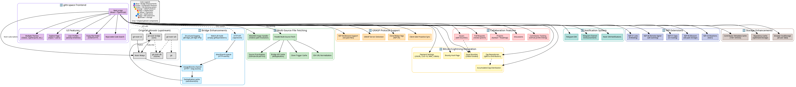

# gittr.space - Git over Nostr with Bitcoin Incentives

A decentralized Git platform built on Nostr with native Bitcoin/Lightning payment integration. Think GitHub, but censorship-resistant, with zaps, bounties, and decentralized storage.

**Platform**: [gittr.space](https://gittr.space)

## 🚀 Features

### Core Repository Management
- ✅ Create, import, fork, and manage repositories
- ✅ Full file tree navigation with branch/tag switching
- ✅ File viewing, editing, and deletion
- ✅ GitHub and GitLab import (single repo and bulk)
- ✅ Commit history, git blame, and diff views
- ✅ Releases and tags management
- ✅ File source indicators (shows where files come from: embedded, git-nostr-bridge, GitHub, GitLab)

### Collaboration
- ✅ Issues with bounties and assignees
- ✅ Pull requests with review system
- ✅ Projects (Kanban board and roadmap views)
- ✅ Discussions (basic implementation)
- ✅ Contributor tracking with GitHub profile linking
- ✅ Notifications (Nostr DM, Telegram DM, channel announcements)

### Payments & Incentives
- ✅ Zap repositories (split to contributors)
- ✅ Issue bounties (funded via LNbits)
- ✅ Accumulated zap distribution (manual split)
- ✅ Payment settings (LNURL, LUD-16, NWC, LNbits)
- ✅ Bounty Hunt page for discovering funded work

### Developer Experience
- ✅ Fuzzy file finder (Cmd/Ctrl+P)
- ✅ Repo-wide code search
- ✅ Copy permalink with deep linking
- ✅ URL parameters for branch/file/path
- ✅ Clone URLs (HTTPS/SSH) with SSH/Git help guide
- ✅ SSH key management (Settings → SSH Keys)
- ✅ Multiple themes (Classic, Cypherpunk, Girly, 80s Arcade)

### Discovery & Social
- ✅ Explore page (repos and users)
- ✅ User profiles with activity timelines
- ✅ Activity tracking and statistics
- ✅ Sponsors page (users who zapped you)
- ✅ Stars and zaps history

## 🛠️ Tech Stack

- **Frontend**: Next.js 13 (App Router), React, TypeScript, Tailwind CSS
- **Backend**: Next.js API routes, Fastify (planned)
- **Nostr**: `nostr-relaypool`, `nostr-tools`
- **Storage**: Browser localStorage (client-side) + NIP-96 Blossom (for Git pack files)
- **Payments**: LNbits, NWC (Nostr Wallet Connect), LNURL/LUD-16
- **Relays**: Default relays + user-configurable
- **Git Operations**: **Go-based git-nostr-bridge** (required for `git clone`/`push`/`pull`)
  - `git-nostr-bridge`: Service that watches Nostr and manages Git repos
  - `git-nostr-ssh`: SSH command handler for Git operations
  - `git-nostr-cli`: CLI tool for managing repos (optional)
  - Located in `ui/gitnostr/` - **All Go components are included!**

## 📊 Architecture & Data Storage

### NIP-34 Architecture (File Storage)

gittr.space follows the **NIP-34 architecture** for repository file storage:

- **Files are stored on git servers** (git-nostr-bridge, GitHub, GitLab, etc.)
- **Nostr events contain references** via `clone` URLs or `sourceUrl` tags
- **Only small metadata files** (like README) are embedded in Nostr events
- **Foreign repos** (imported from GitHub/GitLab) fetch files from their source servers
- **Local repos** can be pushed to git-nostr-bridge for decentralized hosting

**File Source Indicators:**
- 📦 **Embedded**: Files stored directly in Nostr event (legacy)
- ⚡ **git-nostr-bridge**: Files stored on decentralized git server
- 🐙 **GitHub**: Files fetched from GitHub API
- 🦊 **GitLab**: Files fetched from GitLab API

The file source is displayed in the repository's "About" sidebar, making it clear where files are stored.

### File Fetching Flows

gittr.space uses a sophisticated multi-source file fetching system that tries multiple strategies in parallel to ensure fast and reliable file access. The system is designed to work with various git server types (GRASP servers, GitHub, GitLab, Codeberg) and handles both embedded files and files stored on remote servers.

**Key Features of Flows:**

**SSH URL Support**: SSH clone URLs (e.g., `git@github.com:owner/repo`) are automatically normalized to HTTPS format, ensuring compatibility with all git hosting providers.

**Automatic Cloning**: GRASP repositories automatically trigger a clone when not found locally, then retry the API call.

**Robust Fallback Chain**: Both flows have multiple fallback strategies, ensuring files can be fetched even if one source fails.

**Binary File Handling**: Binary files are detected, encoded as base64, and converted to data URLs for display in the browser.

**OwnerPubkey Resolution**: The system uses multiple strategies to resolve the correct owner pubkey, ensuring consistency between file fetching and file opening.

### File Fetching Flow Diagram

```
User clicks on a file
  ↓
Strategy 1: Check localStorage for local repos (no sourceUrl, no cloneUrls)
   ├─ If files found in localStorage → Use local files ✅
   └─ If not found → Continue to Strategy 2
  ↓
Strategy 2: Check if file content is embedded in repoData.files array
   ├─ If found with content → Use embedded content ✅
   └─ If not found → Continue to Strategy 3
  ↓
Strategy 3: Multi-source fetch (if repo has clone URLs)
   ├─ Try all clone URLs in parallel:
   │   ├─ GRASP servers → /api/nostr/repo/files → git-nostr-bridge
   │   │   ├─ If 404 → /api/nostr/repo/clone → Poll (max 10 attempts, 2s delay) ✅
   │   │   └─ If success → Use files from bridge ✅
   │   ├─ GitHub → /api/git/file-content?sourceUrl=...&path=...&branch=...
   │   ├─ GitLab → /api/git/file-content?sourceUrl=...&path=...&branch=...
   │   ├─ Codeberg → /api/git/file-content?sourceUrl=...&path=...&branch=...
   │   └─ Other GRASP servers → /api/git/file-content?sourceUrl=... → forwards to bridge API
   ├─ If GRASP server returns 404 → Trigger clone → Poll (max 10 attempts, 2s delay) ✅
   └─ If all fail → Continue to Strategy 4
  ↓
Strategy 4: Query Nostr for NIP-34 repository events
   ├─ Subscribe to kind 30617 events with "#d" tag matching repo name
   ├─ Extract files from event content (if embedded)
   └─ Extract clone URLs and sourceUrl from event tags
  ↓
Strategy 5: Try git-nostr-bridge API (fallback)
   ├─ Resolve ownerPubkey:
   │   ├─ Check repoData.ownerPubkey
   │   ├─ Check localStorage for matching repo
   │   ├─ Decode npub from params.entity
   │   └─ Fallback to resolveEntityToPubkey utility
   ├─ Success → Use content from git-nostr-bridge ✅
   ├─ 404 (not cloned) → Check if GRASP server
   │   ├─ If GRASP → Trigger clone → Poll (max 10 attempts, 2s delay) ✅
   │   └─ If not GRASP → Continue to Strategy 6
   └─ Error → Continue to Strategy 6
  ↓
Strategy 6: Try external git servers via API proxy (final fallback)
   ├─ GitHub → /api/git/file-content?sourceUrl=...&path=...&branch=...
   ├─ GitLab → /api/git/file-content?sourceUrl=...&path=...&branch=...
   ├─ Codeberg → /api/git/file-content?sourceUrl=...&path=...&branch=...
   └─ Note: SSH URLs (git@host:path) are normalized to HTTPS before API calls
  ↓
Handle binary vs text files
   ├─ Binary → Return base64, frontend creates data URL
   └─ Text → Return UTF-8 content
```

**Why This Order Matters:**

- **Embedded files must be checked FIRST** because:
  - Some GRASP repos have files embedded in Nostr events even when clone URLs exist
  - Embedded content is the most reliable source (no network calls needed)
  - Legacy repos store files directly in events

- **git-nostr-bridge API is second** because:
  - It's the primary method for repos that have been cloned locally
  - For GRASP repos, it requires the repo to be cloned first
  - It's faster than external API calls when available

- **External git servers are last** because:
  - They require network calls
  - They're used as fallback when embedded content and git-nostr-bridge aren't available

**SSH URL Normalization:**
- SSH clone URLs (e.g., `git@github.com:owner/repo`) are automatically converted to HTTPS format (`https://github.com/owner/repo`) before processing
- This normalization happens in all critical paths: file fetching, file opening, cloning, refetching, pushing to Nostr, and importing
- Ensures seamless compatibility with repositories that use SSH clone URLs

**Push to Nostr Process:**
- Files are sourced from `localStorage` (primary) or bridge API (fallback)
- The push process does NOT fetch files from external sources (GitHub, GitLab, etc.)
- Files must already be available in `localStorage` from create/import workflow
- If files are missing, re-import the repository to load all files into `localStorage`
- **Empty commit preservation**: When pushing with no file changes (e.g., to update commit date after refetch), existing files are automatically preserved from the repo to ensure other clients can display files correctly

## What's Stored WHERE

#### ✅ Client-Side (Browser localStorage) - **ALL User Data**
- **Nostr private keys** (encrypted with user password)
- **Payment credentials** (LNbits admin keys, LNURL, NWC - encrypted)
- **Repositories** (metadata; file trees/overrides persist only for owned or locally edited repos)
- **Issues & PRs** (all user data)
- **User settings** (preferences, themes)

**Cache behavior:** View-only foreign repos are kept in memory when possible; anonymous sessions auto-clean gittr repo caches under storage pressure and never touch non-gittr keys.

**✅ All personal data stays on YOUR device - never on the server!**

#### ✅ Server-Side (Next.js API) - **ONLY for processing**
- **Payment processing** (creates invoices, sends zaps) - **NEVER stores user creds**
- **GitHub Platform Token** (optional, for higher API rate limits - see `ui/GITHUB_PLATFORM_TOKEN_SETUP.md`)
- **No database** - no user data stored on server
- **API routes** - can be called from local frontend or hosted frontend

### Deployment Options

**Option 1: Hosted (Recommended)**
- Frontend + API run on your server
- Users access via `https://gittr.space`
- All data still stored in browser localStorage

**Option 2: Standalone Frontend**
- Users run frontend locally (PWA/Electron)
- Connects to your server's API via CORS
- All data still stored locally (browser localStorage)
- Configure `NEXT_PUBLIC_API_URL` to point to your server

**✅ Security**: Your credentials NEVER leave your device, regardless of deployment option!


## 💰 Payment Configuration

### Receiving Payments
Configure in Settings → Account:
- **LNURL**: For LNURL-pay invoices
- **Lightning Address (LUD-16)**: Lightning address format
- **NWC Receive**: Nostr Wallet Connect for receiving

### Sending Payments
- **NWC Send**: Configure Nostr Wallet Connect string for client-side payments
- **LNbits**: Server-side payments (requires LNbits instance)


## 📚 Setup & Documentation

- **[SETUP_INSTRUCTIONS.md](https://gittr.space/npub1n2ph08n4pqz4d3jk6n2p35p2f4ldhc5g5tu7dhftfpueajf4rpxqfjhzmc/gittr?path=docs&file=docs%2FSETUP_INSTRUCTIONS.md)** - Complete production setup guide
- **[LOCAL_SETUP.md](https://gittr.space/npub1n2ph08n4pqz4d3jk6n2p35p2f4ldhc5g5tu7dhftfpueajf4rpxqfjhzmc/gittr?path=docs&file=docs%2FLOCAL_SETUP.md)** - Local development setup
- **[DEPLOYMENT_GUIDE.md](https://gittr.space/npub1n2ph08n4pqz4d3jk6n2p35p2f4ldhc5g5tu7dhftfpueajf4rpxqfjhzmc/gittr?path=docs&file=docs%2FDEPLOYMENT_GUIDE.md)** - Server deployment guide
- **[Grasp Relay Setup](https://gittr.space/npub1n2ph08n4pqz4d3jk6n2p35p2f4ldhc5g5tu7dhftfpueajf4rpxqfjhzmc/gittr?path=docs&file=docs%2FGRASP_RELAY_SETUP.md)** - How to set up your own relay instance (Grasp protocol)
- **[SSH & Git Guide](https://gittr.space/npub1n2ph08n4pqz4d3jk6n2p35p2f4ldhc5g5tu7dhftfpueajf4rpxqfjhzmc/gittr?path=docs&file=docs%2FSSH_GIT_GUIDE.md)** - SSH and Git operations guide


### ⚠️ Repository import size limit

Next.js API routes hard-cap responses at ~4 MB. When importing from GitHub/Codeberg we capture the entire file tree (including binaries/releases), so very large repositories will exceed that limit. When this happens the import dialog now shows a “repository is too large (>4 MB)” error. If you hit it, trim heavy artifacts (release archives, media, build outputs) before retrying, or import a smaller subset of the project.

## 🎨 Themes

gittr.space supports multiple themes:
- **Classic**: Default dark theme with violet accents
- **Cypherpunk**: Neon green on black (terminal aesthetic)
- **Girly**: Pink pastels on dark purple
- **80s Arcade**: Neon cyan/magenta with retro vibes

Change theme in Settings → Appearance.


## 🚧 Roadmap

### High Priority
- Enhanced branch/tag switcher UI
- PR conflict detection
- Commit graph visualization
- Better code search ranking

### Medium Priority
- Keyboard shortcuts overlay
- Line range permalinks
- CI/checks status surface
- VS Code protocol links

### Future
- MCP server integration
- SSH key management
- Security hardening

## 🤝 Contributing

This project is in active development. Contributions welcome!

1. Fork the repository
2. Create a feature branch
3. Make your changes
4. Test thoroughly
5. Submit a pull request

## 📄 License

This project is licensed under the **GNU Affero General Public License v3.0 (AGPL-3.0)**.
The `gitnostr` Go components (`ui/gitnostr/`) are licensed under the **MIT License** (see `ui/gitnostr/LICENSE.md` for details).


## 🙏 Acknowledgments

- Built upon [NostrGit](https://github.com/NostrGit/NostrGit) UI (forked from original)
- Uses [nostr-relaypool](https://github.com/adamritter/nostr-relaypool) for relay management
- Uses [gitnostr](https://github.com/spearson78/gitnostr) Go components for Git operations
- Implements [GRASP Protocol](https://ngit.dev/grasp/) for distributed Git hosting (newer than original NostrGit)
- Inspired by GitHub's developer experience

**Note:** This project (`gittr.space`) is a fork of NostrGit Page template that has been significantly developed. It is a separate project and platform.

### Platform Enhancements Overview



This diagram shows **all enhancements** added to the gittr.space platform across the entire stack. See the [gitnostr bridge fork README](ui/gitnostr/README.md#gittrspace-enhancements) for detailed bridge-specific enhancements.

### Key Additions

- ✅ **GRASP protocol support** (clone/relays tags, client-side proactive sync, NIP-96 Blossom)
- ✅ **Bitcoin/Lightning payment integration** (zaps, bounties, LNbits, LNURL, NWC)
- ✅ **Enhanced UI features** (themes, activity tracking, explore page, fuzzy finder, code search)
- ✅ **Collaboration tools** (issues with bounties, pull requests, projects/Kanban, discussions)
- ✅ **Notification system** (Nostr DM, Telegram DM, channel announcements)
- ✅ **Multi-source file fetching** (parallel fetching, prioritization, caching, README image handling)
- ✅ **NIP extensions** (NIP-25 stars, NIP-51 following, NIP-46 remote signer, NIP-57 zaps, NIP-96 Blossom, NIP-C0 code snippets)
- ✅ **All original Go components** (`git-nostr-bridge`, `git-nostr-cli`, `git-nostr-ssh`) are included and functional with gittr enhancements

### Supported NIPs & Event Kinds

See **[NIPS_AND_EVENT_KINDS.md](https://gittr.space/npub1n2ph08n4pqz4d3jk6n2p35p2f4ldhc5g5tu7dhftfpueajf4rpxqfjhzmc/gittr?path=docs&file=docs%2FNIPS_AND_EVENT_KINDS.md)** for complete documentation.

**Standard NIPs:**
- NIP-01 (Basic Protocol), NIP-11 (Relay Info), NIP-19 (bech32), NIP-22 (Comments), NIP-25 (Reactions/Stars)
- NIP-33/34 (Replaceable Events - Repository announcements)
- NIP-46 (Remote Signer/NIP-07), NIP-57 (Lightning Zaps), NIP-96 (Blossom file storage)
- NIP-C0 (Code Snippets)

**Event Kinds:**
- **Kind 50** – Repository permissions (original gitnostr protocol)
- **Kind 51** – Repository metadata (legacy, read-only support)
- **Kind 52** – SSH keys
- **Kind 1111 (NIP-22)** – Comments (issue/PR comments)
- **Kind 1337 (NIP-C0)** – Code snippets
- **Kind 1618 (NIP-34)** – Pull requests
- **Kind 1619 (NIP-34)** – Pull request updates
- **Kind 1621 (NIP-34)** – Issues
- **Kind 1630-1633 (NIP-34)** – Status events (Open/Applied/Closed/Draft)
- **Kind 30617 (NIP-34)** – Repository metadata (primary source)
- **Kind 30618 (NIP-34)** – Repository state (required for ngit clients)
- **Kind 9806** – Bounties (custom extension)

## 📞 Support

Get into the NIP39-ident-match channel https://t.me/gittrspace, it is open to any other comments. 