# gittr.space - Git over Nostr with Bitcoin Incentives

A decentralized Git platform built on Nostr with native Bitcoin/Lightning payment integration. Think GitHub, but censorship-resistant, with zaps, bounties, and decentralized storage.

**Platform**: [gittr.space](https://gittr.space)

## 🚀 Features

### Core Repository Management
- ✅ Create, import, fork, and manage repositories
- ✅ Full file tree navigation with branch/tag switching
- ✅ File viewing, editing, and deletion
- ✅ GitHub and GitLab import (single repo and bulk)
- ✅ Commit history, git blame, and diff views
- ✅ Releases and tags management
- ✅ File source indicators (shows where files come from: embedded, git-nostr-bridge, GitHub, GitLab)

### Collaboration
- ✅ Issues with bounties and assignees
- ✅ Pull requests with review system
- ✅ Projects (Kanban board and roadmap views)
- ✅ Discussions (basic implementation)
- ✅ Contributor tracking with GitHub profile linking
- ✅ Notifications (Nostr DM, Telegram DM, channel announcements)

### Payments & Incentives
- ✅ Zap repositories (split to contributors)
- ✅ Issue bounties (funded via LNbits)
- ✅ Accumulated zap distribution (manual split)
- ✅ Payment settings (LNURL, LUD-16, NWC, LNbits)
- ✅ Bounty Hunt page for discovering funded work

### Developer Experience
- ✅ Fuzzy file finder (Cmd/Ctrl+P)
- ✅ Repo-wide code search
- ✅ Copy permalink with deep linking
- ✅ URL parameters for branch/file/path
- ✅ Clone URLs (HTTPS/SSH) with SSH/Git help guide
- ✅ SSH key management (Settings → SSH Keys)
- ✅ Multiple themes (Classic, Cypherpunk, Girly, 80s Arcade)

### Discovery & Social
- ✅ Explore page (repos and users)
- ✅ User profiles with activity timelines
- ✅ Activity tracking and statistics
- ✅ Sponsors page (users who zapped you)
- ✅ Stars and zaps history

## 🛠️ Tech Stack

- **Frontend**: Next.js 13 (App Router), React, TypeScript, Tailwind CSS
- **Backend**: Next.js API routes, Fastify (planned)
- **Nostr**: `nostr-relaypool`, `nostr-tools`
- **Storage**: Browser localStorage (client-side) + NIP-96 Blossom (for Git pack files)
- **Payments**: LNbits, NWC (Nostr Wallet Connect), LNURL/LUD-16
- **Relays**: Default relays + user-configurable
- **Git Operations**: **Go-based git-nostr-bridge** (required for `git clone`/`push`/`pull`)
  - `git-nostr-bridge`: Service that watches Nostr and manages Git repos
  - `git-nostr-ssh`: SSH command handler for Git operations
  - `git-nostr-cli`: CLI tool for managing repos (optional)
  - Located in `ui/gitnostr/` - **All Go components are included!**

## 📊 Architecture & Data Storage

### NIP-34 Architecture (File Storage)

gittr.space follows the **NIP-34 architecture** for repository file storage:

- **Files are stored on git servers** (git-nostr-bridge, GitHub, GitLab, etc.)
- **Nostr events contain references** via `clone` URLs or `sourceUrl` tags
- **Only small metadata files** (like README) are embedded in Nostr events
- **Foreign repos** (imported from GitHub/GitLab) fetch files from their source servers
- **Local repos** can be pushed to git-nostr-bridge for decentralized hosting

**File Source Indicators:**
- 📦 **Embedded**: Files stored directly in Nostr event (legacy)
- ⚡ **git-nostr-bridge**: Files stored on decentralized git server
- 🐙 **GitHub**: Files fetched from GitHub API
- 🦊 **GitLab**: Files fetched from GitLab API

The file source is displayed in the repository's "About" sidebar, making it clear where files are stored.

### File Fetching Flows

gittr.space uses a sophisticated multi-source file fetching system that tries multiple strategies in parallel to ensure fast and reliable file access. The system is designed to work with various git server types (GRASP servers, GitHub, GitLab, Codeberg) and handles both embedded files and files stored on remote servers.

#### File List Fetching Flow (Opening a Repository)

When a user opens a repository page, the system fetches the complete file tree using this flow:

```mermaid
flowchart TD
    Start(["User Opens Repo Page\nInput: entity, repo, branch"]) --> CheckCache{"Check localStorage\nInput: entity, repo\nOutput: cached files or null"}
    
    CheckCache -->|Files Found| CacheMatch{"Entity + Repo Match?"}
    CacheMatch -->|Yes| UseCache["✅ Use Cached Files\nOutput: files array\nReturn: Display files"]
    CacheMatch -->|No| CheckEmbedded
    
    CheckCache -->|No Cache| CheckEmbedded{"Check Embedded Files\nInput: repoData.files\nOutput: files array or null"}
    
    CheckEmbedded -->|Files Found| UseEmbedded["✅ Use Embedded Files\nOutput: files array\nReturn: Display files"]
    CheckEmbedded -->|No Files| ResolveOwnerPubkey["Resolve ownerPubkey\nInput: params.entity npub\nProcess: nip19.decode\nOutput: 64-char hex pubkey"]
    
    ResolveOwnerPubkey --> TryBridge{"Try git-nostr-bridge API\nInput: ownerPubkey, repo, branch\nGET /api/nostr/repo/files\nOutput: files array or 404"}
    
    TryBridge -->|200 OK| BridgeSuccess["✅ Files from Bridge\nOutput: files array\nReturn: Display files"]
    TryBridge -->|404 Not Found| CheckGrasp{"Is GRASP Server?\nInput: clone URLs\nCheck: knownGraspServers list"}
    
    CheckGrasp -->|Yes| TriggerClone["Trigger Clone\nInput: cloneUrl, ownerPubkey, repo\nPOST /api/nostr/repo/clone\nOutput: clone started"]
    
    TriggerClone --> WaitClone["Wait 3 seconds\nProcess: setTimeout\nOutput: time elapsed"]
    
    WaitClone --> RetryBridge{"Retry Bridge API\nInput: ownerPubkey, repo, branch\nGET /api/nostr/repo/files\nOutput: files array or 404"}
    
    RetryBridge -->|200 OK| BridgeSuccess
    RetryBridge -->|404| MultiSource["Multi-Source Fetch\nInput: cloneUrls array, branch\nProcess: fetchFilesFromMultipleSources\nUses Promise.race for first success"]
    
    CheckGrasp -->|No| MultiSource

    MultiSource --> ParseSources["Parse Git Sources\nInput: cloneUrls\nProcess: parseGitSource for each URL\nOutput: GitSource objects"]

    ParseSources --> ParallelFetch["Parallel Fetch All Sources\nInput: GitSource array\nProcess: Promise.race\nOutput: First success or all failed"]
    
    ParallelFetch --> GitHub{"Try GitHub\nInput: owner, repo, branch\nAPI: /repos/{owner}/{repo}/git/trees/{sha}\nOutput: files array or error"}

    ParallelFetch --> GitLab{"Try GitLab\nInput: owner, repo, branch\nAPI: /api/v4/projects/{path}/repository/tree\nOutput: files array or error"}

    ParallelFetch --> Codeberg{"Try Codeberg\nInput: owner, repo, branch\nAPI: /api/v1/repos/{owner}/{repo}/git/trees/{branch}\nOutput: files array or error"}

    ParallelFetch --> GraspServers{"Try GRASP Servers\nInput: cloneUrl, npub, repo, branch\nProcess: fetchFromNostrGit\nOutput: files array or error"}
    
    GitHub -->|Success| FirstSuccess["✅ First Success Found\nOutput: files array\nProcess: Update UI immediately\nReturn: Display files"]
    GitLab -->|Success| FirstSuccess
    Codeberg -->|Success| FirstSuccess
    GraspServers -->|Success| FirstSuccess
    
    GitHub -->|Error| ContinueBackground["Continue in Background\nProcess: Update statuses\nOutput: Final status for each source"]
    GitLab -->|Error| ContinueBackground
    Codeberg -->|Error| ContinueBackground
    GraspServers -->|Error| ContinueBackground
    
    FirstSuccess --> UpdateState["Update State & localStorage\nInput: files array\nProcess: setRepoData, localStorage.setItem\nOutput: UI updated, data persisted"]
    
    UpdateState --> End(["✅ Files Displayed\nOutput: File tree visible to user"])
    
    ContinueBackground --> UpdateStatuses["Update Source Statuses\nInput: status for each source\nOutput: Status display updated\nShows: ✓ Fetched or ✗ No files found"]
    
    style Start fill:#e1f5ff
    style UseCache fill:#c8e6c9
    style UseEmbedded fill:#c8e6c9
    style BridgeSuccess fill:#c8e6c9
    style FirstSuccess fill:#c8e6c9
    style End fill:#c8e6c9
    style TriggerClone fill:#fff9c4
    style WaitClone fill:#fff9c4
```



#### File Opening Flow (Clicking a File)

When a user clicks on a file to view its content, the system uses this flow:

```mermaid
flowchart TD
    Start(["User Clicks File\nInput: filePath, branch"]) --> CheckOverrides{"Check Overrides\nInput: localStorage gittr_overrides\nOutput: override content or null"}
    
    CheckOverrides -->|Override Found| UseOverride["✅ Use Override Content\nOutput: fileContent string\nReturn: Display file"]
    CheckOverrides -->|No Override| Strategy1["Strategy 1: Check Embedded Files\nInput: repoData.files array, filePath\nProcess: find matching fileEntry\nOutput: fileEntry with content or null"]
    
    Strategy1 -->|File Found| CheckContentFields{"Check Content Fields\nInput: fileEntry\nCheck: content, data, body, text, fileContent\nOutput: foundContent string or null"}
    
    CheckContentFields -->|Content Found| CheckBinary{"Is Binary?\nInput: fileEntry.isBinary, file extension\nOutput: isBinary boolean"}
    
    CheckBinary -->|Yes| CreateDataURL["Create Data URL\nInput: base64 content, mimeType\nProcess: data:{mimeType};base64,{content}\nOutput: dataUrl string"]
    CreateDataURL --> ReturnEmbedded["✅ Return Embedded Content\nOutput: {content: null, url: dataUrl, isBinary: true}\nReturn: Display file"]
    
    CheckBinary -->|No| ReturnText["✅ Return Text Content\nOutput: {content: foundContent, url: null, isBinary: false}\nReturn: Display file"]
    
    CheckContentFields -->|No Content| Strategy2
    Strategy1 -->|File Not Found| Strategy2["Strategy 2: git-nostr-bridge API\nInput: filePath, branch"]
    
    Strategy2 --> ResolveOwnerPubkey["Resolve ownerPubkey\nPriority 1: repoData.ownerPubkey\nPriority 2: localStorage matching repo\nPriority 3: Decode npub from params.entity\nPriority 4: resolveEntityToPubkey utility\nOutput: 64-char hex pubkey"]
    
    ResolveOwnerPubkey --> CallBridgeAPI{"Call Bridge API\nInput: ownerPubkey, repo, path, branch\nGET /api/nostr/repo/file-content\nOutput: 200 OK with content or 404"}
    
    CallBridgeAPI -->|200 OK| CheckResponseBinary{"Is Binary Response?\nInput: response.isBinary\nOutput: boolean"}
    
    CheckResponseBinary -->|Yes| CreateBridgeDataURL["Create Data URL\nInput: base64 content from API\nOutput: dataUrl string"]
    CreateBridgeDataURL --> ReturnBridgeBinary["✅ Return Bridge Binary\nOutput: {content: null, url: dataUrl, isBinary: true}\nReturn: Display file"]
    
    CheckResponseBinary -->|No| ReturnBridgeText["✅ Return Bridge Text\nOutput: {content: textContent, url: null, isBinary: false}\nReturn: Display file"]
    
    CallBridgeAPI -->|404 Not Found| CheckGrasp{"Is GRASP Server?\nInput: cloneUrls, knownGraspServers\nOutput: boolean"}
    
    CheckGrasp -->|Yes| TriggerClone["Trigger Clone\nInput: cloneUrl, ownerPubkey, repo\nPOST /api/nostr/repo/clone\nOutput: clone started"]
    
    TriggerClone --> PollFile["Poll for File\nInput: apiUrl\nProcess: Loop max 5 attempts, 1s delay\nGET /api/nostr/repo/file-content\nOutput: 200 OK or timeout"]
    
    PollFile -->|200 OK| CheckPollBinary{"Is Binary?\nInput: response.isBinary\nOutput: boolean"}
    
    CheckPollBinary -->|Yes| CreatePollDataURL["Create Data URL\nOutput: dataUrl string"]
    CreatePollDataURL --> ReturnPollBinary["✅ Return Polled Binary\nOutput: {content: null, url: dataUrl, isBinary: true}\nReturn: Display file"]
    
    CheckPollBinary -->|No| ReturnPollText["✅ Return Polled Text\nOutput: {content: textContent, url: null, isBinary: false}\nReturn: Display file"]
    
    PollFile -->|Timeout| Strategy3
    CheckGrasp -->|No| Strategy3["Strategy 3: External Git Servers\nInput: sourceUrl, filePath, branch"]
    
    Strategy3 --> ResolveSourceUrl["Resolve sourceUrl\nPriority 1: repoData.sourceUrl\nPriority 2: repoData.forkedFrom\nPriority 3: clone URLs from repoData\nPriority 4: localStorage matching repo\nOutput: sourceUrl string"]
    
    ResolveSourceUrl --> ParseSource{"Parse Source Type\nInput: sourceUrl\nProcess: Match regex patterns\nOutput: githubMatch, gitlabMatch, codebergMatch"}
    
    ParseSource -->|GitHub| CallGitHubAPI{"Call GitHub API Proxy\nInput: sourceUrl, path, branch\nGET /api/git/file-content\nBackend: raw.githubusercontent.com\nOutput: 200 OK with content or error"}
    
    ParseSource -->|GitLab| CallGitLabAPI{"Call GitLab API Proxy\nInput: sourceUrl, path, branch\nGET /api/git/file-content\nBackend: GitLab API\nOutput: 200 OK with content or error"}
    
    ParseSource -->|Codeberg| CallCodebergAPI{"Call Codeberg API Proxy\nInput: sourceUrl, path, branch\nGET /api/git/file-content\nBackend: Codeberg API\nOutput: 200 OK with content or error"}
    
    CallGitHubAPI -->|200 OK| CheckAPIBinary{"Is Binary?\nInput: response.isBinary\nOutput: boolean"}
    CallGitLabAPI -->|200 OK| CheckAPIBinary
    CallCodebergAPI -->|200 OK| CheckAPIBinary
    
    CheckAPIBinary -->|Yes| CreateAPIDataURL["Create Data URL\nInput: base64 content\nOutput: dataUrl string"]
    CreateAPIDataURL --> ReturnAPIBinary["✅ Return API Binary\nOutput: {content: null, url: dataUrl, isBinary: true}\nReturn: Display file"]
    
    CheckAPIBinary -->|No| ReturnAPIText["✅ Return API Text\nOutput: {content: textContent, url: null, isBinary: false}\nReturn: Display file"]
    
    CallGitHubAPI -->|Error| TryNextBranch{"Try Next Branch\nInput: branchesToTry array\nProcess: Try main, master\nOutput: success or all failed"}
    CallGitLabAPI -->|Error| TryNextBranch
    CallCodebergAPI -->|Error| TryNextBranch
    
    TryNextBranch -->|Success| CheckAPIBinary
    TryNextBranch -->|All Failed| ErrorState["❌ Unable to Load File\nOutput: {content: null, url: null, isBinary: false}\nReturn: Show error message"]
    
    ReturnEmbedded --> RenderFile["Render File Content\nInput: content or url, isBinary\nProcess: CodeViewer, iframe, img, video, etc.\nOutput: File displayed to user"]
    ReturnText --> RenderFile
    ReturnBridgeBinary --> RenderFile
    ReturnBridgeText --> RenderFile
    ReturnPollBinary --> RenderFile
    ReturnPollText --> RenderFile
    ReturnAPIBinary --> RenderFile
    ReturnAPIText --> RenderFile
    
    RenderFile --> End(["✅ File Displayed\nOutput: File content visible to user"])
    
    ErrorState --> End
    
    style Start fill:#e1f5ff
    style UseOverride fill:#c8e6c9
    style ReturnEmbedded fill:#c8e6c9
    style ReturnText fill:#c8e6c9
    style ReturnBridgeBinary fill:#c8e6c9
    style ReturnBridgeText fill:#c8e6c9
    style ReturnPollBinary fill:#c8e6c9
    style ReturnPollText fill:#c8e6c9
    style ReturnAPIBinary fill:#c8e6c9
    style ReturnAPIText fill:#c8e6c9
    style End fill:#c8e6c9
    style TriggerClone fill:#fff9c4
    style PollFile fill:#fff9c4
    style ErrorState fill:#ffcdd2
```



**Key Features of These Flows:**

**Automatic Cloning**: GRASP repositories automatically trigger a clone when not found locally, then retry the API call.

**Robust Fallback Chain**: Both flows have multiple fallback strategies, ensuring files can be fetched even if one source fails.

**Binary File Handling**: Binary files are detected, encoded as base64, and converted to data URLs for display in the browser.

**OwnerPubkey Resolution**: The system uses multiple strategies to resolve the correct owner pubkey, ensuring consistency between file fetching and file opening.

## What's Stored WHERE

#### ✅ Client-Side (Browser localStorage) - **ALL User Data**
- **Nostr private keys** (encrypted with user password)
- **Payment credentials** (LNbits admin keys, LNURL, NWC - encrypted)
- **Repositories** (metadata, files, readme)
- **Issues & PRs** (all user data)
- **User settings** (preferences, themes)

**✅ All personal data stays on YOUR device - never on the server!**

#### ✅ Server-Side (Next.js API) - **ONLY for processing**
- **Payment processing** (creates invoices, sends zaps) - **NEVER stores user creds**
- **GitHub OAuth** (temporary token exchange)
- **No database** - no user data stored on server
- **API routes** - can be called from local frontend or hosted frontend

### Deployment Options

**Option 1: Hosted (Recommended)**
- Frontend + API run on your server
- Users access via `https://gittr.space`
- All data still stored in browser localStorage

**Option 2: Standalone Frontend**
- Users run frontend locally (PWA/Electron)
- Connects to your server's API via CORS
- All data still stored locally (browser localStorage)
- Configure `NEXT_PUBLIC_API_URL` to point to your server

**✅ Security**: Your credentials NEVER leave your device, regardless of deployment option!

## 🔐 Authentication

gittr.space supports multiple authentication methods:

- **NIP-07**: Browser extension (e.g., Alby, Nos2x)
- **Private Key (nsec)**: Direct private key login
- **NIP-05**: NIP05-ID-based verification

## 💰 Payment Configuration

### Receiving Payments
Configure in Settings → Account:
- **LNURL**: For LNURL-pay invoices
- **Lightning Address (LUD-16)**: Lightning address format
- **NWC Receive**: Nostr Wallet Connect for receiving

### Sending Payments
- **NWC Send**: Configure Nostr Wallet Connect string for client-side payments
- **LNbits**: Server-side payments (requires LNbits instance)


## 📚 Setup & Documentation

- **[SETUP_INSTRUCTIONS.md](SETUP_INSTRUCTIONS.md)** - Complete production setup guide
- **[LOCAL_SETUP.md](LOCAL_SETUP.md)** - Local development setup
- **[Concept Document](docs/CONCEPT.md)** - Complete feature specification
- **[Grasp Relay Setup](docs/GRASP_RELAY_SETUP.md)** - How to set up your own relay instance (Grasp protocol)
- **[Testing Guide](MANUAL_TESTING_GUIDE.md)** - Manual testing procedures
- **[Testing Status](TESTING_STATUS.md)** - Current testing status
- **[Open Issues](OPEN_ISSUES.md)** - Known issues and missing features

### ⚠️ Repository import size limit

Next.js API routes hard-cap responses at ~4 MB. When importing from GitHub/Codeberg we capture the entire file tree (including binaries/releases), so very large repositories will exceed that limit. When this happens the import dialog now shows a “repository is too large (>4 MB)” error. If you hit it, trim heavy artifacts (release archives, media, build outputs) before retrying, or import a smaller subset of the project.

## 🎨 Themes

gittr.space supports multiple themes:
- **Classic**: Default dark theme with violet accents
- **Cypherpunk**: Neon green on black (terminal aesthetic)
- **Girly**: Pink pastels on dark purple
- **80s Arcade**: Neon cyan/magenta with retro vibes

Change theme in Settings → Appearance.


## 🚧 Roadmap

### High Priority
- Enhanced branch/tag switcher UI
- PR conflict detection
- Commit graph visualization
- Better code search ranking

### Medium Priority
- Keyboard shortcuts overlay
- Line range permalinks
- CI/checks status surface
- VS Code protocol links

### Future
- MCP server integration
- SSH key management
- Security hardening for production

## 🤝 Contributing

This project is in active development. Contributions welcome!

1. Fork the repository
2. Create a feature branch
3. Make your changes
4. Test thoroughly
5. Submit a pull request

## 📄 License

This project is licensed under the **GNU Affero General Public License v3.0 (AGPL-3.0)**.

The `gitnostr` Go components (`ui/gitnostr/`) are licensed under the **MIT License** (see `ui/gitnostr/LICENSE.md` for details).


## 🙏 Acknowledgments

- Built on [NostrGit](https://github.com/NostrGit/NostrGit) UI (forked from original)
- Uses [nostr-relaypool](https://github.com/adamritter/nostr-relaypool) for relay management
- Uses [gitnostr](https://github.com/spearson78/gitnostr) Go components for Git operations
- Implements [GRASP Protocol](https://ngit.dev/grasp/) for distributed Git hosting (newer than original NostrGit)
- Inspired by GitHub's developer experience

**Note:** This project (`gittr.space`) is a fork of NostrGit Page template that has been significantly developed. It is a separate project and platform. Key additions include:
- ✅ GRASP protocol support (clone/relays tags, client-side proactive sync)
- ✅ Bitcoin/Lightning payment integration (zaps, bounties)
- ✅ Enhanced UI features (themes, activity tracking, explore page)
- ✅ Notification system (Nostr DM, Telegram DM, channel announcements)
- ✅ All original Go components (`git-nostr-bridge`, `git-nostr-cli`, `git-nostr-ssh`) are included and functional

## 📞 Support

Get into the NIP39-ident-match channel https://t.me/gittrspace, it is open to any other comments. 

---

**Status**: Production-ready. Actively maintained.

## System Nostr Account for Sharing

To enable sharing repositories to Nostr without requiring users to log in, configure a system Nostr account:

1. Generate a keypair:
   ```bash
   cd ui
   npm run generate-system-keypair
   ```

2. Add the generated keys to your `.env.local`:
   ```bash
   NEXT_PUBLIC_SYSTEM_NSEC=nsec1your_generated_nsec_here
   NEXT_PUBLIC_SYSTEM_NPUB=npub1your_generated_npub_here
   ```

3. **Important**: Never commit the NSEC to git! Keep it secure.

The system account will be used to sign and publish share notes when users click "Share to Nostr" without logging in.
