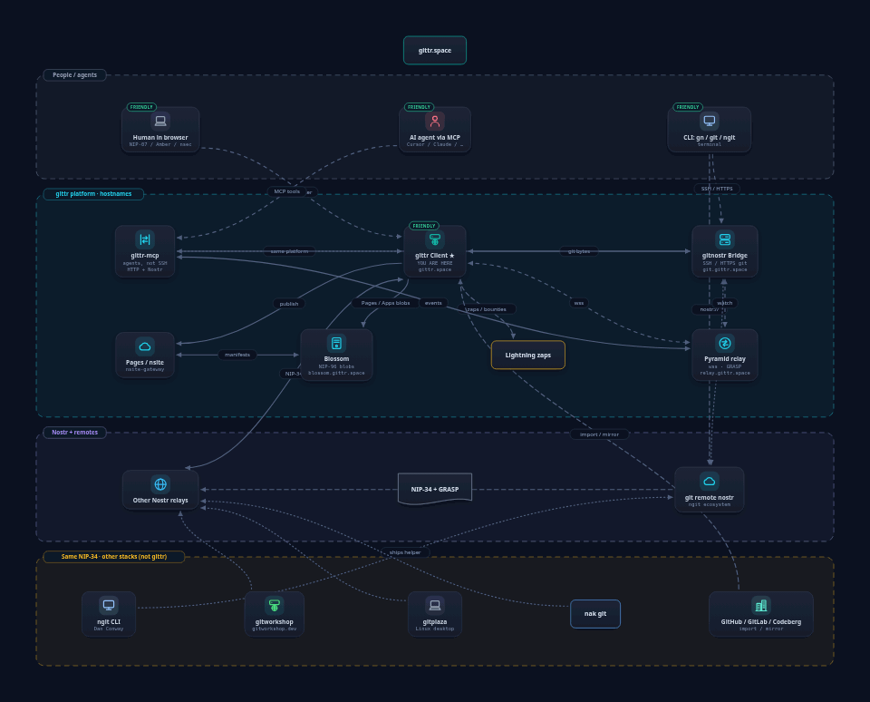

# [gittr.space](https://gittr.space)

**gittr** is Nostr git hosting: a web forge for git on Nostr (NIP-34). Live at [gittr.space](https://gittr.space) — mirror repositories onto relays, run issues and pull requests as signed events, publish static **Pages**, browse a Nostr **apps** catalog, and fund work with Lightning bounties.

What is Nostr git? [gittr.space/nostr-git](https://gittr.space/nostr-git) · [Apps](https://gittr.space/apps) · [Pages](https://pages.gittr.space) · [Relay](https://relay.gittr.space) · [Legal](https://gittr.space/legal) · [Nostr schemata (NIPs)](https://gittr.space/npub1zafcms4xya5ap9zr7xxr0jlrtrattwlesytn2s42030lzu0dwlzqpd26k5/schemata?file=README.md)

Docs: [gittr-docu](https://3un05jr4dnwh6njreq6uhzgv67st83jxi5lnpsbf8y3dkdq1qkgittr-docu.pages.gittr.space/) (`index.html` in this repo) · cookbook [gittr-snips](https://3un05jr4dnwh6njreq6uhzgv67st83jxi5lnpsbf8y3dkdq1qkgittr-snips.pages.gittr.space/)

## Where this sits (platform map)

Super-high-level — who talks to whom. **You are here = gittr Client** (this repo, teal). Host URLs are the cyan-outlined host boxes (teal = this repo; cyan outline = host URLs). Detailed bridge diagrams live in [gitnostr](https://gittr.space/npub1n2ph08n4pqz4d3jk6n2p35p2f4ldhc5g5tu7dhftfpueajf4rpxqfjhzmc/gitnostr?branch=main).

Who talks to whom on this deployment. Interactive map: [docs/gittr-platform.netdraw.json](docs/gittr-platform.netdraw.json) · still frame [docs/gittr-platform.png](docs/gittr-platform.png).

**Where Code-tab files come from** — latest live 30617 is the map; a forge `source` is the tree when present; otherwise clone hosts are tried until one returns files:

Timeline and details: [FILE_FETCHING_INSIGHTS.md](docs/FILE_FETCHING_INSIGHTS.md).

| Piece | Host / repo | Job in one line |
| --- | --- | --- |
| **★ gittr Client (this README)** | [arbadacarbaYK/gittr](https://gittr.space/npub1n2ph08n4pqz4d3jk6n2p35p2f4ldhc5g5tu7dhftfpueajf4rpxqfjhzmc/gittr?branch=main) · `gittr.space` | Web UI: Code, Issues/PRs, Push, import, ToDo, Apps |
| **gitnostr Bridge** | [arbadacarbaYK/gitnostr](https://gittr.space/npub1n2ph08n4pqz4d3jk6n2p35p2f4ldhc5g5tu7dhftfpueajf4rpxqfjhzmc/gitnostr?branch=main) (`ui/gitnostr/`) · **`git.gittr.space`** | Real git over SSH/HTTPS; watches relays; kind 52 keys |
| **Pages / nsite** | [arbadacarbaYK/nsite-gateway](https://gittr.space/npub1n2ph08n4pqz4d3jk6n2p35p2f4ldhc5g5tu7dhftfpueajf4rpxqfjhzmc/nsite-gateway) · **`pages.gittr.space`** | Static sites from Nostr (gittr Pages) |
| **Blossom** | [gittr-blossom](https://gittr.space/npub1n2ph08n4pqz4d3jk6n2p35p2f4ldhc5g5tu7dhftfpueajf4rpxqfjhzmc/gittr-blossom?branch=master) · **`blossom.gittr.space`** | Blob storage for Pages and Nostr git media |
| **gittr Pyramid relay** | [arbadacarbaYK/pyramid](https://gittr.space/npub1n2ph08n4pqz4d3jk6n2p35p2f4ldhc5g5tu7dhftfpueajf4rpxqfjhzmc/pyramid) · **`relay.gittr.space`** (`wss://`) | Open forge + discussion relay; GRASP-capable |
| **gittr-mcp** | [arbadacarbaYK/gittr-mcp](https://gittr.space/npub1n2ph08n4pqz4d3jk6n2p35p2f4ldhc5g5tu7dhftfpueajf4rpxqfjhzmc/gittr-mcp) | Same platform for AI agents (HTTP + Nostr, not SSH) |
| **gittr-helper-tools** | [arbadacarbaYK/gittr-helper-tools](https://gittr.space/npub1n2ph08n4pqz4d3jk6n2p35p2f4ldhc5g5tu7dhftfpueajf4rpxqfjhzmc/gittr-helper-tools?branch=main) | Integrator snippets + a Nostr Page cookbook (`index.html`, listed on [gittr.space/pages](https://gittr.space/pages) as **gittr-snips**) |
| **git remote nostr** | [ngit / git-remote-nostr](https://github.com/DanConwayDev/ngit-cli) | `nostr://` remotes — other stack, same NIP-34 events |

**Addressing:** repos are Nostr identities (`npub` / hex) + repo name on relays; git blobs live on **`git.gittr.space`** (or another `clone` host). Share still shows a short `Name/repo` URL — that opens the same repo (and the X/Telegram card includes the About text). Sites on **`pages.gittr.space`**; Pages/media blobs on **`blossom.gittr.space`**. Prefer publishing to **`wss://relay.gittr.space`** plus other relays. Agents resolve via MCP; humans via the UI or `git clone` / `nostr://`.

Import from GitHub, GitLab, Codeberg, or your own git remote when you want a Nostr mirror or a path off a centralized host—not a skin on top of another forge’s login. The repo sidebar **Git Server** stays that GitHub/GitLab/Codeberg URL; gittr/ngit mirrors stay in the clone list. Clearing browser storage does not turn published repos into “Local” — the live Nostr announcement is the source of truth. Long My Repositories / Refetch / Push messages use an in-app dialog that grows with the text (the browser’s own alert box used to clip them).

**If Chrome asks gittr to “access devices on your local network”:** that is the browser blocking a public website from opening sockets to home machines (Umbrel, `.local`, Tailscale). gittr.space does **not** need that permission — it was a bug (your relay list or a repo announcement listing a home address). Block it. gittr is not scanning your LAN.

## Use it for

- **Mirror / backup** — Push or import a repo. Files live on the **gitnostr** bridge (`git-nostr-bridge`, and/or upstream); metadata on relays.
- **Issues & PRs on Nostr** — Same workflow as a normal forge. A PR event is the title, description, and git pointers; the patch lives on the clone host (ngit, gitworkshop, and gittr all read those pointers). Comments on issues **and** PRs are NIP-22 (kind **1111**) on that event. Share the long event-id URL (`/issues/<hex>` or `/pulls/<hex>`). GitHub-imported items keep the forge number (`/pulls/12` is PR #12 on GitHub) and stay a **separate** list row — close or merge those on the origin; gittr will not unsync them. You can still comment here; that comment is Nostr-only. Bounties pay when a **gittr Nostr PR** is merged here — merging on GitHub does not pay. The repo **ToDo** tab on a **forge-backed** repo shows GitHub Projects read-only. On a **Nostr-only** repo it can pull currently **open** issues onto a board that stays in this browser (closed tickets are not offered).
- **Pages** — Owners publish a static site with **Push Manifest**. Browse [/pages](https://gittr.space/pages).
- **gittr on Android / Zapstore** — The website is still the product (PWA or clone this repo to self-host). Other Nostr app stores look for a GitHub **Release** with an **APK**, so a `v*` tag (`v1.0.0` and up) builds a thin `space.gittr.app` wrapper around [gittr.space](https://gittr.space) ([`android-app/`](android-app/README.md), [`zapstore.yaml`](zapstore.yaml)). Announce that tag from this repo’s Releases tab with app id **`space.gittr.app`** (keep it — a new id is a second listing). That announce publishes the dark-plate bird as the app icon, phone screenshots from `ui/public/zapstore/`, and the about line “Decentralized and discoverable Nostr gits, apps and pages”. The APK may live on gittr’s Blossom; other apps still announce — they just pin to public Blossoms (Primal, Ditto, Haven), not `blossom.gittr.space`. Other listings copy a public Settings logo or a `logo.*` file on the linked forge, and copy **`images:`** from *their* source-repo `zapstore.yaml` (repo-relative paths or https URLs) onto the Nostr screenshots — they can also paste extra https URLs in the announce panel. gittr’s own listing has no paste box. Phone users already on the APK tap **Update app** in the user menu (or the hamburger when signed out) to fetch a newer GitHub installer; the website inside the app already matches live gittr.space and keeps Home / Search / New below the phone status icons.
- **Apps** — Browse NIP-82 apps at [/apps](https://gittr.space/apps) (Zapstore’s relay is where most of those events live, plus gittr and a few other relays). **Listed** is unique publisher + package id in **one** merged list — not “Zapstore’s number plus everyone else.” After paging that relay, Listed can sit around **~3300**: about **3000** are Zapstore’s own catalog indexer (one npub republishing a large mobile catalog), and a few hundred are every other publisher on Nostr (including gittr announces). That is not gittr counting the same app five times, and owner **Remove listing** (NIP-09) still only hides *your* card, not the indexer’s copy. The number used to stall near **~509** because Zapstore would not send thousands of apps in one request; gittr now walks 50 at a time. Republishing the same id (a new version of buho-go, for example) updates the card without adding 1. Cards show **Repo** for the source you can audit: a gittr Code tab when the announce has a NIP-34 `a` pointer, otherwise the NIP-82 / Zapstore `repository` URL (that tag is a `git clone` URL — Zapstore listings almost always have it). **Releases** is the forge download page when we can name one, **Website** is the homepage. Owners **Announce** a forge Release tag from the Code sidebar (**Nostr Apps**, latest) or the Releases tab (same form, chosen tag). That lists the app; it does **not** add the APK to the git tree. Visitors get **Links** on the Code About sidebar with the **app name** (same as `/apps`; hydrated from the catalog if this browser never announced) and downloads on **Releases**. Duplicate App rows for the same package id are collapsed. Signed-in: user menu **Your Apps** lists your cards; **Remove listing** deletes one app id (the leftover `GITTR` card, for example) without deleting the git repo or the APK file. The Code-tab app link stays so the next Push still publishes it. A handle URL like `/DrShift/buho-go` redirects to the npub Code URL so files and Push work. Details: [Help → Releases](https://gittr.space/help#releases).
- **Releases tab** — Lists forge Release assets (GitHub / Codeberg / GitLab) and any NIP-82 / Blossom releases already on Nostr. A Nostr version like `1.0.0` is the same GitHub tag as `v1.0.0`. gittr’s own Zapstore APK uses **1.0.0 and up** (no more 0.x tags). **New listing** is notes in this browser only — not an app announce. Separate from Push to Nostr.
- **Bounties** — Fund or solve issues; zaps via LNbits / NWC / LNURL.
- **Home Recent Activity** — Latest public Nostr for repos, apps, pages, and (when the snapshot has them) issues/PRs/commits. Same list signed in or out. Clicking a PR or commit opens that page from the network (not only this browser’s local cache).

Sitemap/SEO: [docs/SEO.md](docs/SEO.md) — public hubs, per-repo and per-app URLs, JSON-LD, and the production repo index.

## Nostr git ecosystem (how gittr fits)

**gittr** is a web forge built on **[gitnostr](https://gittr.space/npub1n2ph08n4pqz4d3jk6n2p35p2f4ldhc5g5tu7dhftfpueajf4rpxqfjhzmc/gitnostr?branch=main)** (`ui/gitnostr/`): the UI talks to relays; **git push/pull** goes through the **git-nostr-bridge** (hosted at `git.gittr.space` or self-hosted). That is separate from **[ngit](https://ngit.dev)** (CLI + `nostr://`), which pairs with **[gitworkshop](https://gitworkshop.dev)** instead.

The [awesome-nostr](https://github.com/aljazceru/awesome-nostr#git) list names several **independent** NIP-34 tools. They share **NIP-34** on relays (often **GRASP** for multi-host `clone` URLs), but not the same codebase—think **protocol → git server → UI/CLI**, not one app per bullet.

| Layer                   | Project                                                                                               | Role                                                                                                                                                         |
| ----------------------- | ----------------------------------------------------------------------------------------------------- | ------------------------------------------------------------------------------------------------------------------------------------------------------------ |
| Protocol                | [NIP-34](https://github.com/nostr-protocol/nips/blob/master/34.md) + [GRASP](https://ngit.dev/grasp/) | Signed repo/issue/PR events; optional multi-mirror git hosts                                                                                                 |
| **Git server (bridge)** | **[gitnostr](https://gittr.space/npub1n2ph08n4pqz4d3jk6n2p35p2f4ldhc5g5tu7dhftfpueajf4rpxqfjhzmc/gitnostr?branch=main)** (`ui/gitnostr/`)                            | `git-nostr-bridge`, SSH/HTTPS bare repos, kind **52** SSH keys, optional **`push_cost_sats`** paywall, **`git-nostr-cli`** (`gn`). **Not the same as ngit.** |
| Web client              | **[gittr](https://gittr.space)**                                                                      | This repo: UI **on gitnostr**; hosted bridge on `git.gittr.space`; [self-host the bridge](docs/GIT_NOSTR_BRIDGE_SETUP.md)                                    |
| Web client              | **[gitworkshop](https://gitworkshop.dev)**                                                            | GRASP web client; sparse git explorer; pairs with ngit; fetches from **ngit GRASP** git mirrors (same class of hosts gittr uses)                             |
| CLI (ngit stack)        | **[ngit](https://ngit.dev)**                                                                          | `ngit init`, `pr/` branches, **`nostr://` remotes** via [git-remote-nostr](https://github.com/DanConwayDev/ngit-cli) — different codebase from gitnostr      |
| Desktop                 | **[gitplaza](https://gitplaza.netlify.app)** ([Codeberg](https://codeberg.org/dluvian/gitplaza))       | Linux desktop NIP-34 client (Rust/Iced): repos, issues, **patches** (diffs), releases, kanban, inbox. **No git bridge**—clone tags + [GitWorkshop](https://gitworkshop.dev) / [ngit](https://ngit.dev) per upstream README |

**gittr ≠ ngit:** gittr ships and runs **gitnostr**. **ngit** is Dan Conway’s CLI + `git-remote-nostr`. They interoperate on the **same Nostr events** (kinds 30617/30618, issues, PRs); day-to-day **git push/pull** on gittr.space uses **SSH/HTTPS to the bridge**, not the ngit binary. Feature-by-feature (SSH, paywall, `nostr://`, PRs): [gitnostr README — gitnostr vs ngit](https://gittr.space/npub1n2ph08n4pqz4d3jk6n2p35p2f4ldhc5g5tu7dhftfpueajf4rpxqfjhzmc/gitnostr?branch=main).

### More on [awesome-nostr § git](https://github.com/aljazceru/awesome-nostr#git)

Also listed there but not in the stack table above (different layer or adjacent tooling):

| Project                                                                                | Role                                                                                                                                                                                                                                                                |
| -------------------------------------------------------------------------------------- | ------------------------------------------------------------------------------------------------------------------------------------------------------------------------------------------------------------------------------------------------------------------- |
| **[nak](https://github.com/fiatjaf/nak)** ([nostr army knife](https://nak.nostr.com/)) | fiatjaf’s general **Nostr CLI** (events, relays, Blossom, negentropy, …). For git: **`nak git`** — `clone`, `init`, `sync`, `fetch`, `pull`, `push` on **NIP-34 / GRASP** repos. On awesome-nostr under **Tools**, not Clients. Not a web forge; not gitnostr/ngit. |
| **[gitstr](https://github.com/fiatjaf/gitstr)**                                        | **Deprecated** — old NIP-34 **patch** CLI (`git str send` / `download`). Successor: **`nak git`** (and broader **`nak`**).                                                                                                                                          |
| **[git-nostr-tools](http://git.jb55.com/git-nostr-tools)**                             | jb55 CLI for sending **code patches** over Nostr (related research line to gitstr).                                                                                                                                                                                 |
| **[git-nostr](https://github.com/colealbon/git-nostr)**                                | Cole Albon’s **pre-prototype** `git-nostr` CLI (publish patches, issues, PRs to relays; [nostrin.gs](https://nostrin.gs) / [git.nostrin.gs](https://git.nostrin.gs)). Separate stack from gitnostr/ngit—custom event tags                                           |
| **[gittr-helper-tools](https://gittr.space/npub1n2ph08n4pqz4d3jk6n2p35p2f4ldhc5g5tu7dhftfpueajf4rpxqfjhzmc/gittr-helper-tools?branch=main)**          | **Integrator snippets** from gittr production plus a Nostr Page cookbook (`index.html`) — not a hosted forge.                                                                                           |
| **[gittr-mcp](https://github.com/arbadacarbaYK/gittr-mcp)**                            | **MCP server** for AI hosts (Cursor, Claude, …): push to bridge, issues/PRs, stars, bounties on **gittr + gitnostr**. [gitnostr docs](https://gittr.space/npub1n2ph08n4pqz4d3jk6n2p35p2f4ldhc5g5tu7dhftfpueajf4rpxqfjhzmc/gitnostr?branch=main). |
| **[Zapounty](https://github.com/ZigBalthazar/zapounty)**                               | **GitHub** app: Lightning **bounties on GitHub issues** (zaps). No Nostr git client.                                                                                                                                                                                |

### Git access on gittr

| Method                        | On gittr.space                                         | Notes                                                                                                                                                                                                                     |
| ----------------------------- | ------------------------------------------------------ | ------------------------------------------------------------------------------------------------------------------------------------------------------------------------------------------------------------------------- |
| SSH / HTTPS to bridge         | **Yes**                                                | `git@git.gittr.space:<npub>/repo.git` — no local bridge install; see [SSH_GIT_GUIDE.md](docs/SSH_GIT_GUIDE.md)                                                                                                            |
| Self-host **gitnostr** bridge | **Yes**                                                | Same code as `ui/gitnostr/`; [GIT_NOSTR_BRIDGE_SETUP.md](docs/GIT_NOSTR_BRIDGE_SETUP.md)                                                                                                                                  |
| **git-nostr-cli** (`gn`)    | **Yes** (in tree)                                      | Publish/manage repos from shell; bridge reacts on relays                                                                                                                                                                  |
| **nostr:// clone**            | **Yes** (interop)                                      | Needs **`git-remote-nostr`** on your machine (ngit ecosystem). gittr publishes standard `clone` tags and shows `nostr://…` in the UI; see [help → clone options](https://gittr.space/help). gittr does **not** ship ngit. |
| **htree:// (Iris Hashtree)**  | **Recognized** (no in-app tree yet)                    | Valid NIP-34 `clone` from [Iris Git](https://git.iris.to/). Sidebar shows **Iris Git** for `web=https://git.iris.to/#/…`. Code browser links out + shows `git clone htree://…` (needs `git-remote-htree`). Never rewritten to `https://htree://`. Not a default GRASP host. |
| **nak git**                   | **No** (install [nak](https://github.com/fiatjaf/nak)) | Same NIP-34/GRASP interop; different CLI from git-nostr-cli (`gn`)                                                                                                                                                        |
| **gittr-mcp** (AI agents)     | **Yes** ([install](https://github.com/arbadacarbaYK/gittr-mcp#install-5-minutes)) | MCP in Cursor/Claude/etc.; HTTP + Nostr against gittr.space (or self-hosted gittr). Not SSH git. **Git HTTP fixes** (`uploadpack.allowFilter`, CORS on `git.gittr.space`) live on the **server** — MCP users get them automatically when cloning that host. MCP **code** updates (clone-tag rules, tools) need `git pull` / a new `.mcpb` release — they are **not** auto-pushed to every Cursor install. |

### Feature comparison

Classic forges vs typical Nostr git clients (ngit + gitworkshop / gitplaza and similar) vs gittr. Named clients and CLIs are in the stack table above. **✓** / **✗** = has it / does not; other cells are how that column does the job.

| oldschool gits                    | nostr git clients                         | gittr                                              |
| --------------------------------- | ----------------------------------------- | -------------------------------------------------- |
| Public or Private                 | ✗                                         | ✓                                                  |
| PRs and Issues                    | ✓                                         | ✓                                                  |
| Version control, Branches         | shows releases                            | Create and push a release                          |
| Release Assets per repo           | shows assets                              | Push & browse Apps, Push2Zapstore                  |
| Pages                             | ✗                                         | Push, add to repo links & browse Pages             |
| Discussion Boards                 | ✗                                         | ✓                                                  |
| Project- / Milestone planning     | ✗                                         | Add open issues to planning                        |
| Notifications, Follow/Watch       | ✗                                         | Standard, pre/CVE alerts                           |
| Centralized account               | Sovereign account                         | Pairing with ext. Identities, WoT Badge            |
| Centralized hosting               | Announce sov. git hosting                 | Batch-/import from all forges                      |
| Centralized discoverability       | Nostr git wide discoverability            | SEO                                                |
| Webclient, App                    | ngit CLI write, Web/App read              | Webclient, App, MCP to read and write              |
| Centralized SSH keys              | ✗                                         | SSH keys, pre/CVE Security Scan                    |
| ✗                                 | ✗                                         | Themes                                             |
| ✗                                 | Zaps (LNaddr, LNURL, NWC)                 | LNbits/Blink-api (Zap-Split, Bounties)             |
| ✗                                 | ✗                                         | Architecture, Dependencies                         |
| ✗                                 | ✗                                         | Dependency Lab                                     |

**Notes**

- **oldschool gits** — GitHub, GitLab, Codeberg, Gitea and similar: public or private repos, PRs/issues, branches, release assets, Pages, discussion boards, milestones, watch/notifications, a hosted account and host, their search/SEO, a web client (and often an app), SSH keys on their servers.
- **nostr git clients** — Typical NIP-34 tools: issues/PRs yes; they can **show** releases and assets; write git is usually **ngit CLI**, web/app is mostly read; sovereign npub; you announce your own git host; discovery is Nostr-wide; zaps (LNaddr, LNURL, NWC). No private repos, Pages, boards, planning, notifications, or in-app SSH keys.
- **gittr** — built on **[gitnostr](https://gittr.space/npub1n2ph08n4pqz4d3jk6n2p35p2f4ldhc5g5tu7dhftfpueajf4rpxqfjhzmc/gitnostr?branch=main)** (`ui/gitnostr/`, MIT). Public or private; create and push a release; push & browse Apps (Push2Zapstore); push Pages, add them to repo links, and browse them; discussions; pull open issues onto planning; standard plus pre/CVE alerts; pair external identities and WoT badges; batch-import from forges; SEO; web, app, and MCP read **and** write; SSH keys plus pre/CVE security scan; themes; LNbits/Blink (zap-split, bounties); architecture/dependencies and Dependency Lab.
- **Other awesome-nostr entries** — [nak](https://github.com/fiatjaf/nak) (`nak git`), [gitstr](https://github.com/fiatjaf/gitstr) (deprecated), [git-nostr-tools](http://git.jb55.com/git-nostr-tools), [git-nostr](https://github.com/colealbon/git-nostr), [gittr-helper-tools](https://gittr.space/npub1n2ph08n4pqz4d3jk6n2p35p2f4ldhc5g5tu7dhftfpueajf4rpxqfjhzmc/gittr-helper-tools?branch=main), [Zapounty](https://github.com/ZigBalthazar/zapounty): see table above.
- **NostrGit** — historical **UI** template only (see Lineage—not the **gitnostr** bridge gittr runs).

Corrections welcome.

## Features include

Repos: create, import (incl. bulk GitHub, or paste GitLab/Codeberg/Forgejo URL, or a Nostr `npub/repo` / GRASP clone), fork (copies the parent tree, not just About), browse/edit files, blame, diffs, releases, tags, **Delete Repository** (owner-signed; Nostr deletion marker). **Import** copies a forge or Nostr-only repo onto your npub (you are **owner**); **Fork** on gittr is a separate repo with a “forked from” parent and the parent’s files. A GitHub URL on an import is provenance, not a fork badge. Collaboration: issues (bounties — a feature, or an issue sitting for a security disclosure), PRs, **Projects** (Kanban + Roadmap + milestones), **discussions** (NIP-23 on relays; this browser only caches them — a “quota” error there means localStorage is full, not that Nostr rejected the post), **notifications** (Nostr/Telegram — prefs on kind 30078 `gittr/notifications`, recipient-scoped delivery), **Watch** / **Star**. **Security (opt-in):** Dependencies tab OSV audit; optional CVE alerts via Settings → Notifications → Security (`CVE_BOT_ENABLED`) — private Nostr/Telegram DMs only, never a public issue. Same toggle also gets private early (pre-CVE) Spoiler Alert DMs, not shown on Dependencies. Payments: repo zaps, **Zap Split Policy** (share with contributors), issue bounties, optional `push_cost_sats` paywall on GUI + SSH push. Dev UX: fuzzy finder, code search, permalinks, **Share as snippet** (NIP-C0), HTTPS/SSH clone, SSH keys in Settings → SSH Keys, themes, PWA. Discovery: explore (Nostr-wide git announces — ngit / Shakespeare / NostrHub, not only this server’s git bridge), **profiles** (styled npub page: every public Nostr repo for that npub, plus that person’s **Pages** and **Apps**, plus an **Activity Timeline** heatmap — not only ones you already opened), stars, sponsors. Logged-in **Web of Trust** badges show hop distance from *you* on repo owners, apps, and Pages (not a global score). **Settings → Profile → Verified Identities** publishes NIP-39 claims (GitHub, X, …) so others can tell you are the same person — useful when they judge that graph. Header **Lab** is a display-only snapshot of ecosystem dependencies around gittr (which repos that use them look affected); per-repo CVEs stay on the Dependencies tab. Repo Settings → **Repository Links** puts docs, YouTube, Discord, Twitter, or other posts on the repo page.

Details and edge cases: [docs/](docs/) (especially [FILE_FETCHING_INSIGHTS.md](docs/FILE_FETCHING_INSIGHTS.md), [NIPS_AND_EVENT_KINDS.md](docs/NIPS_AND_EVENT_KINDS.md), [WOT.md](docs/WOT.md)).

## Stack

| Layer      | Tech                                                                                      |
| ---------- | ----------------------------------------------------------------------------------------- |
| UI         | Next.js 16 (App Router), React 19, TypeScript, Tailwind                                    |
| Nostr      | `nostr-relaypool`, `nostr-tools`                                                          |
| Git server | `git-nostr-bridge`, `git-nostr-ssh`, `git-nostr-cli` in `[ui/gitnostr/](ui/gitnostr/)`    |
| App blobs  | NIP-96 Blossom (NIP-82 `/apps`, Pages uploads; large packs—not git objects on the bridge) |
| Payments   | NIP-57 zaps (`lud16` / LNURL-pay), LNbits, NWC, LNURL                                     |

## Files & storage

- **Big files** sit on git servers (bridge, GitHub, GitLab, …); Nostr events hold `clone` / `source` URLs and small embedded bits (e.g. README).
- **Markdown preview** (README, opened `.md` files, issue/PR bodies) shows GitHub tables and turns `:emoji:` shortcodes such as `:no_entry:` into the real emoji.
- **Browser** keeps keys, settings, and repo metadata in `localStorage` (encrypted where applicable). The hosted API processes payments and git proxies; it does not store your Nostr/Lightning secrets.
- **Profiles** list that npub’s **Nostr git announcements** (kind 30617). Same grid whether you are logged in or not (Follow / In your network are the session extras). Not GitHub, and not whatever happened to be in your browser cache. Names and avatars come from public kind 0 — Amber is not required to *see* them (only to publish your profile). The avatar is the kind-0 `picture`: a normal https URL, a Blossom blob (gittr retries other public mirrors if one host 502s), or a tiny SVG/PNG pasted into the profile event itself. A **repo** logo (NIP-34 `image` / `logo.png`) is only for repo cards and the repo header — it is not the person’s profile picture. If the public profile still showed the default bird while Explore showed a real pic, that was gittr ignoring those inline pictures.
- **Amber (phone signer):** Push asks Amber to approve a signature. If the phone never pops up, the request did not decrypt — not a git-file problem. If the browser says it could not open any bunker relay, Amber never got the request (sockets stayed closed) — keep Amber open/unlocked, wait for the file list to settle, then retry. Details: [NIP46_REMOTE_SIGNER_INTEGRATION.md](docs/NIP46_REMOTE_SIGNER_INTEGRATION.md). **Settings → Security** should say remote signer (not NIP-07). Encryption on that page is for an nsec or Account payment secrets in the browser — not for the key on your phone.
- **Server-only** (production `/opt/ngit/data/`): notification consent + CVE bot pending/dedup JSON — never deploy these from a laptop; see [SETUP_INSTRUCTIONS.md](docs/SETUP_INSTRUCTIONS.md).
- **Fetch order**: embedded → published `clone[]`/`source` (non-GRASP before GRASP) → bridge / `GET /api/git/repo-files` → forge APIs; well-known GRASP mirrors inferred only after a 30617 with empty clones (not during the 3s wait). Full flow: [docs/FILE_FETCHING_INSIGHTS.md](docs/FILE_FETCHING_INSIGHTS.md). Home Freebox/NAS clones must be reachable from the **gittr server**, not only your browser. Star, visibility, Refetch, and new issues use that same announcement (including a foreign GRASP clone URL). gittr’s own file API 404s when the repo was never mirrored on `git.gittr.space` — that is expected. Watch/Star/GitHub in the repo header stay put while files and README load; README uses the first clone that already worked instead of waiting for every source to finish. Header clicks (Home, Explore, Issues, Apps, …) should react right away even while a page is still filling in — including while a profile’s Followers/Following still show `…`. If a jump stalls, home (and Apps from a profile) reloads instead of doing nothing. A GitHub mirror that was deleted or made private is skipped (no 30s wait / 404 storm) — the gittr page still opens from Nostr. The account menu (avatar) closes when you pick a page — it used to stay open after the click.

Deploy: hosted ([SETUP_INSTRUCTIONS.md](docs/SETUP_INSTRUCTIONS.md)) or local UI + `NEXT_PUBLIC_API_URL` ([LOCAL_SETUP.md](docs/LOCAL_SETUP.md), [DEPLOYMENT_GUIDE.md](docs/DEPLOYMENT_GUIDE.md)).

**Import limit:** API responses cap ~4 MB; huge trees (binaries, release assets) may fail import—trim or import a smaller slice.

## Docs

- [SETUP_INSTRUCTIONS.md](docs/SETUP_INSTRUCTIONS.md) — production
- [LOCAL_SETUP.md](docs/LOCAL_SETUP.md) — dev
- [DEPLOYMENT_GUIDE.md](docs/DEPLOYMENT_GUIDE.md) — ops reference (checklist, relays, maintenance)
- [SSH_GIT_GUIDE.md](docs/SSH_GIT_GUIDE.md) — `git clone` / `git push` over SSH
- [GRASP_RELAY_SETUP.md](docs/GRASP_RELAY_SETUP.md) — own relay

## Roadmap

- better Branch/tag UI, PR conflicts, commit graph, search ranking
- Shortcuts overlay, line permalinks, CI surface, VS Code links
- MCP integration, security hardening

## License

- App: **AGPL-3.0** — full text in `[ui/LICENSE](ui/LICENSE)` (root copy may be added for GitHub detection).
- `ui/gitnostr/`: **MIT** — `[ui/gitnostr/LICENSE.md](ui/gitnostr/LICENSE.md)`.

## Lineage

| Project                                            | Role                                                                                                                                                                             |
| -------------------------------------------------- | -------------------------------------------------------------------------------------------------------------------------------------------------------------------------------- |
| [gitnostr](https://gittr.space/npub1n2ph08n4pqz4d3jk6n2p35p2f4ldhc5g5tu7dhftfpueajf4rpxqfjhzmc/gitnostr?branch=main) | **Git server** (bridge/SSH) — [`ui/gitnostr/`](ui/gitnostr/) in this monorepo; same tree on [gittr.space](https://gittr.space/npub1n2ph08n4pqz4d3jk6n2p35p2f4ldhc5g5tu7dhftfpueajf4rpxqfjhzmc/gitnostr?branch=main) |
| **gittr**                                             | This repo — **web forge** on top of gitnostr                                                                                        |
| [NostrGit](https://github.com/NostrGit/NostrGit)   | Historical **UI** template only (not the bridge codebase)                                                                                                                        |

Also: [nostr-relaypool](https://github.com/adamritter/nostr-relaypool), [GRASP](https://ngit.dev/grasp/). Stack diagram: [docs/gittr-platform-enhancements.png](docs/gittr-platform-enhancements.png) · bridge notes: [ui/gitnostr/README.md](ui/gitnostr/README.md).

NIPs/kinds: [docs/NIPS_AND_EVENT_KINDS.md](docs/NIPS_AND_EVENT_KINDS.md). Interop: NIP-34 `a` tags, NIP-51 repo lists (`10018`), NIP-32 labels (`1985`) for **ngit**, **gitworkshop**, and other NIP-34 clients.

## Support

Telegram: [https://t.me/gittrspace](https://t.me/gittrspace)

Nostr: [https://njump.me/npub1nur7st367ys7cqtjyv74alu84y209zsw8wagpxvrl3g9q2veqzuqjqh65s](https://njump.me/npub1nur7st367ys7cqtjyv74alu84y209zsw8wagpxvrl3g9q2veqzuqjqh65s)
