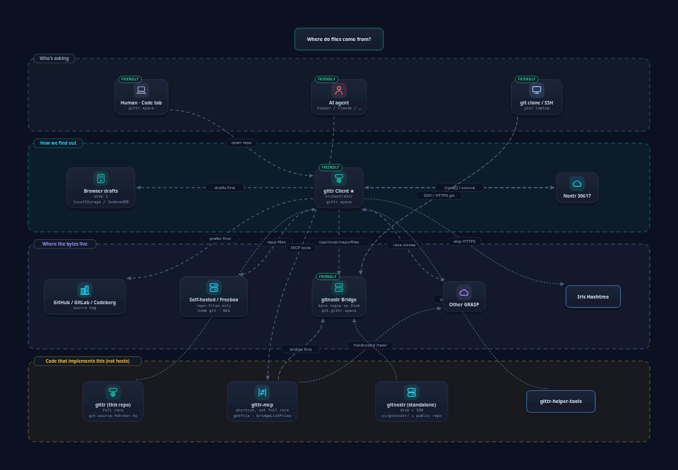
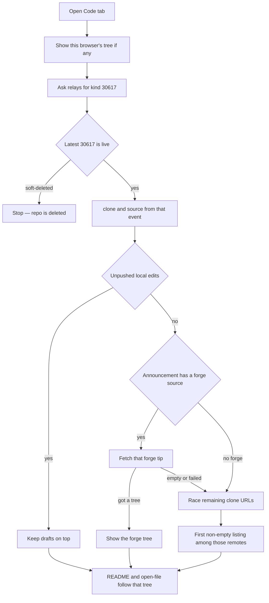

# File fetching

How the **Code tab** gets a file tree and file bytes.

The picture is the **map**: who can hold the bytes, and which tools talk to which host. The **timeline** of one Code-tab open is the flowchart below.

Interactive map (optional): [file-fetch.netdraw.json](file-fetch.netdraw.json) · still frame [file-fetch.png](file-fetch.png).

This page is Code-tab loading. The **Insights** tab is a different screen: it uses the same tree (`fileCount` / `gittr_files`) plus issue/PR stores, commit cache, live star count, and (when a GitHub upstream is known) languages and commit totals.

Implementation:

- `ui/src/lib/utils/git-source-fetcher.ts` — classify clones, list trees, GRASP / self-hosted shallow clone
- `ui/src/components/repo/RepoCodePage.tsx` — Code tab orchestration
- `ui/src/pages/api/nostr/repo/files.ts`, `file-content.ts`, `clone.ts`, `tree-last-commits.ts`, `sync-from-source.ts`
- `ui/src/pages/api/git/repo-files.ts`, `file-content.ts` — server-side `git clone` / `git show`
- `ui/src/lib/git/bare-repo-tree-last-commits.ts` — last-commit dates on the Code file list
- `ui/src/lib/utils/filter-display-clone-urls.ts` — sidebar clone list (forge `source` plus every pushable GRASP host)

## Timeline (Code tab)

Two different “newest”s:

| Layer | What wins |
| --- | --- |
| **Is this repo live?** | The latest kind **30617**. If that event is soft-deleted, file fetch stops and the repo is deleted. A newer live 30617 beats an older deleted one. Kind **30618** (state / SHAs) never brings a deleted repo back. |
| **Which file tree?** | If the live announcement has a forge **`source`** (GitHub, GitLab, Codeberg, …) and you have no unpushed drafts, that **forge tip** is the tree — including files removed upstream. Only when there is no forge, or the forge fetch fails, do remaining `clone[]` hosts race: **first non-empty listing**. gittr does not compare commit SHAs across `git.gittr.space` vs ngit vs GitHub. |

**Bridge already has files, GitHub (or another `source`) is newer:** the old tree can show for a moment from this browser. Then the forge listing is fetched and **replaces** it. Push with no local edits runs `sync-from-source` so the bridge bare repo catches up, then 30618 announces those SHAs. Unpushed Upload/edits stay on top until you Push.

**Other ways to get files** (not this race):

| Who | What happens |
| --- | --- |
| **`git clone` / SSH** | Talks only to the clone host (on this deployment: **`git.gittr.space`**). Bare repo on disk. |
| **gittr-mcp `getFile`** | Bridge, then a short GRASP list. Not the full Code-tab race. Prefer `bridgeListFiles` after a mirror, or resolve **30617 `clone[]`** and call the same HTTP APIs the UI uses. |

## Hosts on this deployment

| Host | What it is |
| --- | --- |
| **`git.gittr.space`** | Git over HTTPS and SSH. Clone URLs, bare repos, Push. |
| **`relay.gittr.space`** | Nostr relay (`wss://`). Kind **30617** announcements, stars, issues. Not a git clone host. |

Clone tags use the **git** host. The relay is how the announcement is found.

## Security (outbound remotes)

Clone / import / file-fetch APIs reject private, loopback, link-local, and metadata hosts (and DNS that resolves to them). Public HTTPS remotes work: GitHub, GitLab, Codeberg, GRASP (`relay.ngit.dev`, `git.gittr.space`, …), and self-hosted forges the **gittr server** can reach. Laptop-only NAS URLs (`*.local`, `192.168.*`) are not fetched from the server.

## Loading the file tree

1. **Browser `localStorage`** — owned or previously loaded trees show immediately. Network refresh still runs when there is a GitHub mirror (or an npub/hex route that needs a live announcement).
2. **Embedded files** in a Nostr repo event (legacy / small repos).
3. **Kind 30617** on relays — published **`clone[]` and `source` tags are the map**. Query includes the viewer’s relays plus NIP-34 discovery (`relay.gittr.space`, `relay.ngit.dev`, shakespeare, nostrhub, gitnostr, `nos.lol`).
4. **Timers:** after ~3s, multifetch and bridge fallback start even if tags are still arriving (the subscription stays open). After **20s**, the metadata sub closes. Well-known GRASP URLs are filled in only when a matching 30617 has **empty** `clone[]`, or as last resort if **no** 30617 arrived by EOSE.
5. **Which tree:**
   - Forge **`source`** and no local drafts: fetch that forge first (`/api/git/repo-files`). That listing is the Code tab (smaller than the bridge is OK — upstream deletes).
   - Otherwise **parallel race** over `clone[]` (**45s** for the first success). **Winner among those remotes = first non-empty listing.** A 502 from one mirror does not block another.
   - Forge and self-hosted HTTPS are asked before GRASP; bare `http://IP:port` last.
   - GitHub in the URL list is preflighted up to 20s; success returns immediately.
   - With Amber / NIP-46 paired, HTTP concurrency is **2**.
6. **Per URL** (`parseGitSource`):
   - **GRASP** (`nostr-git`): bridge `GET /api/nostr/repo/files` → if empty, `GET /api/git/repo-files?sourceUrl=` → optional `POST /api/nostr/repo/clone` (~12s) + bridge retry.
   - **Self-hosted** (including a non-GRASP host with `/npub1…/repo`): **`repo-files` only**.
   - **Forge** (GitHub / GitLab / Codeberg): `repo-files` (server shallow clone); GitHub REST is fallback.
   - **`htree://`**: skipped here — see [Iris Hashtree](#iris-hashtree-htree) below.
7. Once a tree is on screen (`gittr_files` / live ref), that fetch is done. Extra clone successes update the sidebar; they do not restart the race or the README.

**Huge trees** (thousands of files): the bridge may return `listing: "shallow"` (one directory level). Opening a folder GETs that path’s children.

**File list dates:** `GET /api/nostr/repo/tree-last-commits` on the same tip/branch (text marker `>>>COMMIT<<<`, not `%x00`).

## Loading one file or folder README

Same winner as the tree. Branch comes from `?branch=`, then `filesBranch` / `resolvedBranch` from multifetch.

1. Local overrides / IndexedDB (`resolveLocalOverrideBody`) — unpushed Upload drafts win until Push.
2. Multifetch **`successfulSources`** via `/api/git/file-content`.
3. If there is **no** forge upstream and **no** winner yet: bridge `GET /api/nostr/repo/file-content` (skip after a full 404).
4. Indexed / embedded listing body.
5. Forge `/api/git/file-content` when `shouldPreferUpstreamContent` (GitHub / GitLab.com / Codeberg only).
6. Remaining `clone[]` only if multifetch has no winners yet.
7. Binary → base64 / data URL in the browser.

Relative README images (``) resolve against **that markdown file’s folder**.

Normal READMEs (up to ~200 KB) format automatically; only enormous bodies need **Show formatted README**.

### Content states

| State | Meaning | README / openFile |
| --- | --- | --- |
| **Local only** | Drafts / `hasUnpushedEdits` / overrides / IDB | Overrides / IDB first, else indexed body |
| **Nostr / GRASP only** | 30617 `clone[]` to `git.gittr.space` or other GRASP; no forge `source` | Bridge `file-content`, then GRASP HTTPS / indexed |
| **External git source** | Forge `sourceUrl` | Forge `/api/git/file-content`; bridge is fallback |
| **On gittr bridge** | Bare under `reposDir/{pubkey}/{repo}.git` | Bridge when there is no forge; if also forge-imported, use the **forge** tip |

**Overrides:** small text lives in `gittr_overrides__*`. Large / binary drafts (GIFs, folder packs) live in IndexedDB (`gittr-overrides-v1`); storage only keeps a `__gittr_idb__:mime` pointer. Anything that **reads file contents** (Push, Pages, README, openFile, blame, merge) uses `loadRepoOverridesResolved` / `resolveLocalOverrideBody`.

## Classification (`parseGitSource`)

| Pattern | Type | Fetch path |
| --- | --- | --- |
| Known GRASP host + `/npub1…/repo`, or `/grasp/npub1…/repo` | `nostr-git` | Bridge → `repo-files` → optional bare mirror |
| Other host + `/npub1…/repo` (home NAS, …) | `self-hosted-git` | **`repo-files` only** |
| github.com / gitlab.com / codeberg.org | forge | `repo-files` / forge APIs |
| Other `https://host/owner/repo` | `self-hosted-git` | `repo-files` |

`git@host:path` is normalized to HTTPS for HTTP APIs. Generic `user@host:path` (no `://`) is self-hosted git for `/api/git/*`.

## Iris Hashtree (`htree://`)

Some NIP-34 announces (e.g. [Iris Git](https://git.iris.to/)) use `clone` → `htree://npub1…/repo` (needs `git-remote-htree` on the machine) and `web` → `https://git.iris.to/#/…`. gittr labels these and, when every clone is Hashtree-only, shows an Iris CTA plus copyable `git clone htree://…`. The bridge cannot clone `htree://`.

## GRASP remotes

Many GRASP hosts have no file-browse REST API — only `git clone` over HTTPS. For each clone URL, in parallel:

1. On-disk bridge — `GET /api/nostr/repo/files`
2. Remote shallow clone — `GET /api/git/repo-files?sourceUrl=` (returns files to the UI when the remote has commits)
3. Bare mirror — `POST /api/nostr/repo/clone`, then bridge reads (~12s)

Wrong default branch is common (`main` vs `develop`). Files, file-content, and tree-last-commits fall back `main`↔`master`, then the bare HEAD, then other heads. Success includes the resolved `branch`.

The gittr bridge **404s** `GET /api/nostr/repo/files` when this host is not in `clone[]`. That is expected: the UI then reads the owner’s announced clone host. Foreign GRASP is not permanently copied onto `git.gittr.space`.

## What “newest” means

| Question | Behaviour |
|----------|-----------|
| Newest **live announcement** (30617)? | Yes — highest `created_at`. Soft-deleted latest 30617 → no files, repo is deleted. |
| Newest **git commit across every clone host**? | No. Kind **30618** is not compared across `git.gittr.space` / ngit / GitHub to pick a tip. |
| Forge **`source`** vs stale bridge listing? | The forge listing is the Code tab (no local drafts). Push then syncs the bridge to that tip. |
| Several GRASP clones, no forge? | First non-empty listing among those URLs. |

Star, Watch, Public/Private, Refetch, Commits, and new Issue/PR use the **same** 30617 as file fetch (`resolveLiveRepoAnnouncement`).

## GitHub / forge mirror

When a GitHub (or GitLab / Codeberg) `source` / `clone` URL exists, that forge is authoritative for the **tree** unless the user has unpushed edits. **About / description** stays owner-set; GitHub only fills empty or placeholder About text.

**Refetch** after import: small trees may hydrate a few text files via `/api/git/file-content`. Large trees (≥ 50 files) skip that flood; Push announces the forge tip with one `POST /api/nostr/repo/sync-from-source`. Refetch is tip sync, not a local rewrite (`hasUnpushedEdits` stays false).

The browser does not `fetch(raw.githubusercontent.com)` for file bodies (no CORS). README images may **hotlink** GitHub raw; on failure they fall back to same-origin file APIs.

A richer local tree is kept for **Nostr-only** repos (so a thin GRASP listing cannot wipe folders). A declared forge `source` / `forkedFrom` **may shrink** the tree to match upstream (deletes included), and **Refetch** always may.

**Hollow extras:** path-only rows (no file bytes) — often leftover `dist/*` from import — do **not** count as a richer tree and do **not** block persist. Real local uploads with bodies are kept. A stuck `hasUnpushedEdits` flag plus empty `dist/` stubs was making Push look like it skipped the already-published repo and never refreshed README.

**Pages:** owners go live with **Push Manifest** (Blossom + kind 35128, same signer as Push — including Amber). A README pagelink and custom site name are optional. **Open a tracking issue** is for non-owners only; it is not a pull request and does not publish the site. A custom Pages name is stored in the browser (not on kind 30617); hydrate must not wipe it. NIP-5A names are 1–13 characters (`conference-loop` → `conference-lo`).

## Sidebar: Git Server and Clone URL

- **Git Server** is the forge URL from the announcement when one exists. For Nostr-only repos it is a GRASP clone from the same event (on this deployment, `git.gittr.space` when that host is listed).
- **Clone URL (event)** shows forge `source` plus **every** host on the push GRASP set (`git.gittr.space`, ngit, shakespeare, gitnostr, …).
- After Clear local / flush, the live 30617 still fills description, clone tags, and event id.

## Push tip

SSH and HTTPS `git push` write real objects into the bridge bare repo. **UI Push** with a forge `source` and no local edits syncs that bare tip from the forge (`sync-from-source`) and announces those SHAs in kind **30618**. MCP `createRepo` / `mirrorRepo` advertise the full GRASP push clone set; forge URLs stay in `source`.

## Ops

- Set `GIT_NOSTR_BRIDGE_REPOS_DIR` if Next and the bridge run as different users.
- `GET /api/git/repo-files` runs **on the gittr server**. Home NAS URLs in `clone[]` must be reachable from that host, not only from the visitor’s laptop.
- Push troubleshooting: [BRIDGE_PUSH_DEBUGGING.md](BRIDGE_PUSH_DEBUGGING.md).

## Tests

| Suite | Command |
| --- | --- |
| UI tip / clone / timestamps | `cd ui && npm run test:regressions` |
| MCP clone set + forge match | `cd ../gittr-mcp && npm run test:regressions` |

## Integrators

- Snippets: [gittr-helper-tools `snippets/file-fetching`](https://github.com/arbadacarbaYK/gittr-helper-tools) — keep `parseGitSource` in sync with this file.
- Sidebar policy: `snippets/filter-display-clone-urls`.
- MCP: gittr-mcp `docs/MCP-GITTR-PARITY.md`.
