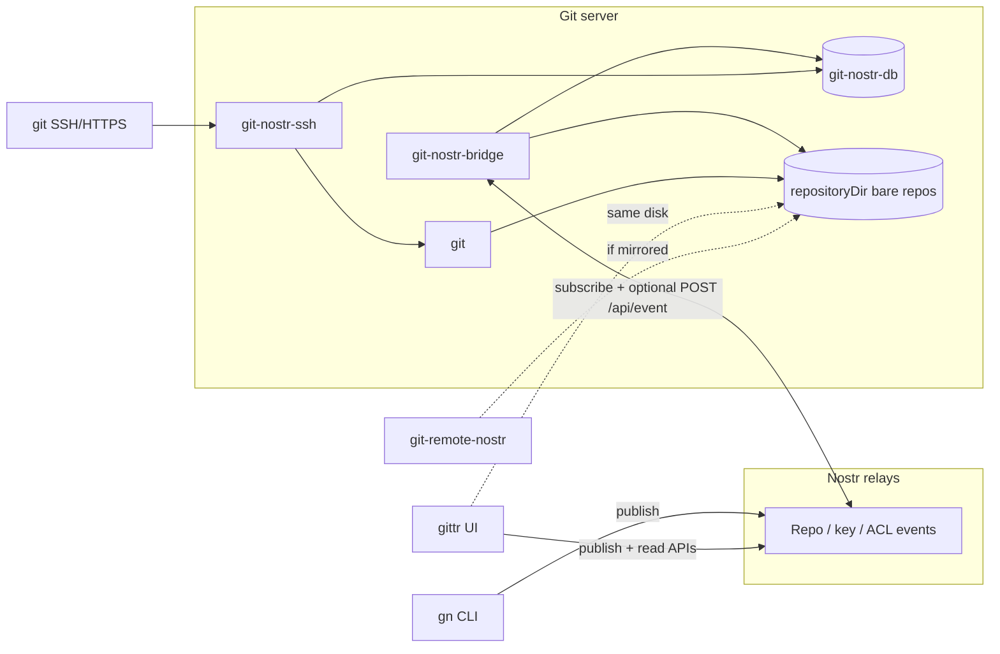

# gitnostr infrastructure (what runs today)

Nostr holds **discovery and policy** (repos, permissions, SSH keys). Your server holds **bare git** and enforces access. There is **no `git-nostr-hook`** in this codebase—`git push` / `pull` go through **`git-nostr-ssh`** and normal `git`.

## Components on the server

| Component | Role |
| --- | --- |
| **`git-nostr-bridge`** | Subscribes to relays (kinds **50**, **51**, **52**, **30617**, **30618**, …). Updates SQLite, creates/updates bare repos under `repositoryDir`, refreshes `authorized_keys` from kind **52**. Optional **`POST /api/event`** when `BRIDGE_HTTP_PORT` is set (fast path for signed events). |
| **`git-nostr-db`** | SQLite cache of permissions, repo rows, SSH keys, push-paywall grants—so **`git-nostr-ssh`** can allow/deny when relays are slow or down. |
| **`repositoryDir`** | Bare repos: `{pubkey}/{repo}.git`. Source of truth for bytes on disk. |
| **`git-nostr-ssh`** | `sshd` forced command for `git-upload-pack` / `git-receive-pack`. Reads ACL (+ optional **`push_cost_sats`**) from SQLite. |
| **`git`** | Standard git binaries invoked by `git-nostr-ssh`. |
| **nginx / HTTPS** (optional) | Smart HTTP git in front of the same bare repos (`git clone https://git.your-host/...`). |

With **[gittr](https://gittr.space/arbadacarbaYK/gittr?branch=main)** on the same host: the Next.js app sets **`GIT_NOSTR_BRIDGE_REPOS_DIR`** to the **same** `repositoryDir` for file trees, commits API, and import—no second copy of the repos.

## How clients connect

| Client | What you use | How it reaches the server |
| --- | --- | --- |
| **Web forge (gittr)** | Browser + NIP-07 (or nsec) | **Relays** for issues/PRs/repo events; **SSH/HTTPS** for `git push`/`pull`; **Next.js** routes read `repositoryDir` for Code/Commits tabs. Publish SSH keys in **Settings → SSH Keys** (kind **52**, same as `gn`). |
| **CLI operator (`gn`)** | `git-nostr-cli` | Publishes kind **30617** (repo), **52** (SSH key), permission events to **relays** → bridge applies them. Then `git clone git@host:npub/repo.git`. |
| **Normal git** | OpenSSH + `git` | `git@git.gittr.space:<npub>/repo.git` (or your host) → **`git-nostr-ssh`** → ACL check → `git` on bare repo. |
| **`git-remote-nostr`** | [ngit-cli](https://github.com/DanConwayDev/ngit-cli) helper | `git clone nostr://<npub>/<repo>` when the repo is **mirrored on your bridge** (same bare repo as SSH). Interop transport, not a separate hook. |
| **HTTPS git** | `git` + HTTPS remote | Clone/push against nginx-fronted bare repo (same disk as bridge). |

**Publish path (all clients):** signed Nostr events → relays → bridge (and optionally **`POST /api/event`**) → SQLite + disk + `authorized_keys`.

**Git bytes path:** `git` → SSH or HTTPS → **`git-nostr-ssh`** (or HTTP git) → bare repo on disk.

## Diagram

Rendered from [`architecture.dot`](../architecture.dot) as **`git-nostr.png`** in the repo root (regenerate with `dot -Tpng architecture.dot -o git-nostr.png`).

## Production extras (gittr.space)

HTTP **`/api/event`**, event deduplication, **watch-all** (`gitRepoOwners: []`): [gittr-enhancements.md](gittr-enhancements.md).

## More detail

- [SSH_GIT_GUIDE.md](../SSH_GIT_GUIDE.md) — clone URLs, keys, workflows  
- [file-fetch-flow.md](file-fetch-flow.md) — bridge disk + gittr file APIs  
- [STANDALONE_BRIDGE_SETUP.md](STANDALONE_BRIDGE_SETUP.md) — self-host the bridge  
