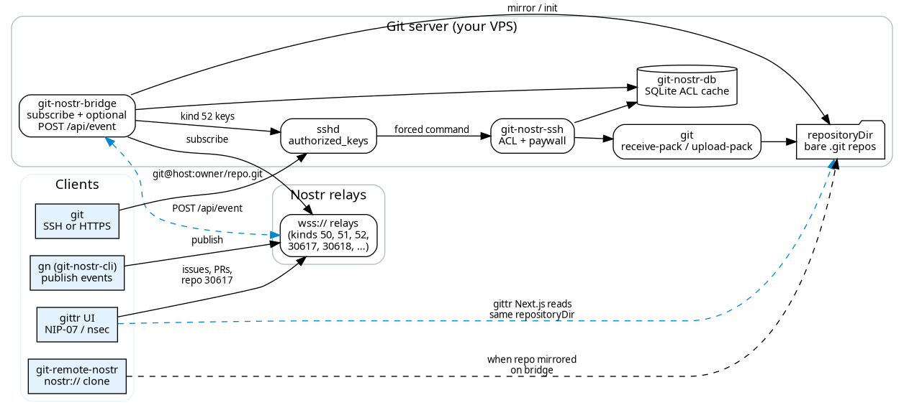

# gitnostr

**Git bridge to Nostr for [gittr](https://gittr.space).** Same codebase as [`arbadacarbaYK/gitnostr`](https://github.com/arbadacarbaYK/gitnostr). **SSH/HTTPS git is native to the bridge** (`git-nostr-ssh`)—not “only through the web UI”; keys via **`gn`**, kind **52** events, or optionally gittr Settings.

**When to use it / use cases:** [README → When gitnostr is the better fit](https://github.com/arbadacarbaYK/gitnostr#when-gitnostr-is-the-better-fit) (forge backend, client integration, own-server backup, normal `git@` workflow, public mirror, push paywall). **vs ngit:** [same section + table](https://github.com/arbadacarbaYK/gitnostr#gitnostr-vs-ngit).

Integration of git and Nostr providing

- repository management
- ssh-key management
- repository permission management

This will hopefully form part of a solution for creating a decentralized version of the github/gitlab experience.

## Documentation

- **[SSH & Git Access Guide](SSH_GIT_GUIDE.md)** - Complete guide for using SSH with git-nostr-bridge (cloning, pushing, pulling, permissions)
- **[SSH & Git guide](https://github.com/arbadacarbaYK/gittr/blob/main/docs/SSH_GIT_GUIDE.md)** — user-facing workflows and examples
- **[CLI push example](https://github.com/arbadacarbaYK/gittr/blob/main/docs/CLI_PUSH_EXAMPLE.md)** — HTTP API examples for pushing repositories programmatically

I chose to build on top of the existing git tooling to allow the client side dev tools to remain largely unchanged for daily work (standard git commands work including push and pull)

**Full stack:** this folder is the **git server** only. **[gittr](https://gittr.space)** adds **issues, PRs, commits, bounties, Pages, apps** on the same relays. Canonical README (diagram notes, no outdated “PRs are a separate project” text): **[github.com/arbadacarbaYK/gitnostr](https://github.com/arbadacarbaYK/gitnostr#how)**.


# How

 — **ignore `git-nostr-hook`** (not shipped). Issues/PRs live in **gittr**, not in this diagram. See [upstream README → How](https://github.com/arbadacarbaYK/gitnostr#how).

## git-nostr-db

An sqlite DB is used to cache the latest version of the data needed to perform access control checks to avoid development downtime in case of a relay or the git-nostr-bridge being offline.

### git-nostr-bridge

Connects to a set of relays and:
1. subscribes to the events needed to keep the git-nostr-db up to date
2. creates git repositories as needed
3. updates the ssh authorized_keys file

**DO NOT RUN THE BRIDGE AS YOUR OWN USER YOU WILL LOSE YOUR AUTHORIZED_KEYS FILE**

### git-nostr-ssh

Configured as the command for a nostr users ssh-key in the authorized_keys file.
Whenever a user tries to perform a git operation (push/pull) git-nostr-ssh will perform an access control check.
Repository owners are always treated as `ADMIN` for their own repositories, even if a cached permission row is missing/stale.
If a repository has a configured push paywall (`push_cost_sats > 0`), SSH write operations (`git-receive-pack`) also require a non-expired paid authorization grant in bridge SQLite. If a pending invoice already exists for the payer identity, SSH can print `pending invoice (BOLT11): ...` directly. Each successful push consumes one paid authorization.

### git-nostr-hook (not shipped)

Planned upstream idea only — **not built here**. See [gitnostr README → git-nostr-hook](https://github.com/arbadacarbaYK/gitnostr#git-nostr-hook-not-shipped).

### git-nostr-cli (gn)

Command line tool with similar options to the github cli that will publish the relevant events using your private key to the configured relays

git-nostr-bridge will then react to these events and update the DB and create any git repos needed.


# Setup Instructions

**Linux**, **Go 1.20+**, **public wss relays** (same as gittr production)—not a required local nostr-rs-relay. Details: [gitnostr README → Setup](https://github.com/arbadacarbaYK/gitnostr#setup-instructions) · [gittr `GIT_NOSTR_BRIDGE_SETUP.md`](../../docs/GIT_NOSTR_BRIDGE_SETUP.md).

**gittr.space:** Bridge-only install: clone **`https://github.com/arbadacarbaYK/gitnostr`**. Monorepo build: use **`ui/gitnostr/`** (this directory).

## git-nostr-bridge

**These instructions are needed if you intend to host git repositories. If another nostr user has configured a git-nostr-bridge for you then follwo the git-nostr-cli instructions below.**

Create a new user to host the git repositories (This is needed as the bridge will overwrite the authroized_keys file) and switch to the new account

**DO NOT RUN THE BRIDGE AS YOUR OWN USER YOU WILL LOSE YOUR AUTHORIZED_KEYS FILE**

```bash
sudo useradd --create-home git-nostr
sudo su - git-nostr
```

Clone **gitnostr** and build the bridge components

```bash
git clone https://github.com/arbadacarbaYK/gitnostr.git
cd gitnostr
make git-nostr-bridge
```

Start the bridge once to create the empty config files. **DO NOT RUN THE BRIDGE AS YOUR OWN USER YOU WILL LOSE YOUR AUTHORIZED_KEYS FILE**

```bash
./bin/git-nostr-bridge
```

You should get the message `no relays connected`

Edit the config file at `~/.config/git-nostr/git-nostr-bridge.json`. The default file should look like this

```
{
    "repositoryDir": "~/git-nostr-repositories",
    "DbFile": "~/.config/git-nostr/git-nostr-db.sqlite",
    "relays": [],
    "gitRepoOwners": []
}
```

Add your relay of relays to the list of relays. **You should use a local relay for testing until the implementation is finalized.**
Add your public key to the list of gitRepoOwners. **It is recommended to generate a new nostr private/public key pair for testing**

git-nostr-bridge will follow events published by gitRepoOwners and create git repositories for them.

My local testing config looks like this

```
{
    "repositoryDir": "~/git-nostr-repositories",
    "DbFile": "~/.config/git-nostr/git-nostr-db.sqlite",
    "relays": ["ws://localhost:8080"],
    "gitRepoOwners": ["e0e7807d354ea7662412d99856335e1923b0b57b6668575bf320837f6b1816e3"]
}
```

You can now start the bridge again. **DO NOT RUN THE BRIDGE AS YOUR OWN USER YOU WILL LOSE YOUR AUTHORIZED_KEYS FILE**

```bash
./bin/git-nostr-bridge
```

As no events have been published you should see no console output.

Your git-nostr-bridge is now ready for use

## git-nostr-cli (gn)

**Watch out for a conflict with the gn command from https://gn.googlesource.com **

Clone **gitnostr** and build the cli components

```bash
git clone https://github.com/arbadacarbaYK/gitnostr.git
cd gitnostr
make git-nostr-cli
```

run the git-nostr-cli command once to create the default config file

```bash
./bin/gn
```

You should get the message `no relays connected`

Edit the config file at `~/.config/git-nostr/git-nostr-cli.json`. The default file should look like this

```
{
    "relays": [],
    "privateKey": "",
    "gitSshBase": ""
}
```

Add your relay of relays to the list of relays. **You should use a local relay for testing until the implementation is finalized.**
Set your private key. **It is recommended to generate a new nostr private key for testing**
Set gitSshBase to the ssh user@hostname where a git-nostr-bridge has been installed.

My local testing config looks like this

```
{
    "relays": ["ws://localhost:8080"],
    "privateKey": "...",
    "gitSshBase": "git-str@localhost"
}
```

Publish your ssh-key. you may need to replace id_rsa.pub with the correct public key file

```bash
./bin/gn ssh-key add ~/.ssh/id_rsa.pub
```

Create a test repository and clone it. replace <publickey> with the hex represenation of your public key. If you are using a nip05 capable public key you can use the nip05 identifier instead.

```bash
./bin/gn repo create test
./bin/gn repo clone  <publickey>:test
```

You can set write permission for your repository with the following command. replace <publickey> with the hex represenation of your public key. If you are using a nip05 capable public key you can use the nip05 identifier instead.

```bash
./bin/gn repo permission test <publickey> WRITE
```
