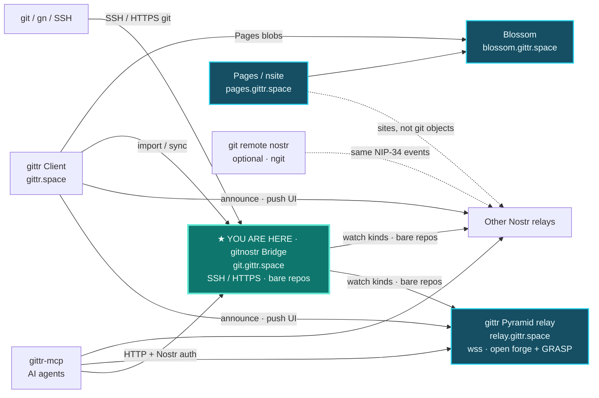

# gitnostr

**Git bridge to Nostr** for [gittr](https://gittr.space). Same codebase as **[arbadacarbaYK/gitnostr](https://gittr.space/npub1n2ph08n4pqz4d3jk6n2p35p2f4ldhc5g5tu7dhftfpueajf4rpxqfjhzmc/gitnostr?branch=main)** on gittr.

**Components:** `git-nostr-bridge` · `git-nostr-ssh` · `git-nostr-db` · `git-nostr-cli` (`gn`)

## Where this sits (platform map)

This repo is the **git server layer** — not the website and not the AI tools. **You are here = gitnostr Bridge** (`git.gittr.space`, teal). Cyan-outlined host boxes = public hostnames (teal = this repo; cyan outline = host URLs).



```mermaid
flowchart LR
  UI["gittr Client<br/>gittr.space"]
  MCP["gittr-mcp<br/>AI agents"]
  CLI["git / gn / SSH"]
  Bridge["★ YOU ARE HERE · gitnostr Bridge<br/>git.gittr.space<br/>SSH / HTTPS · bare repos"]
  RelayGittr["gittr Pyramid relay<br/>relay.gittr.space<br/>wss · open forge + GRASP"]
  Relays["Other Nostr relays"]
  Pages["Pages / nsite<br/>pages.gittr.space"]
  Blossom["Blossom<br/>blossom.gittr.space"]
  Remote["git remote nostr<br/>optional · ngit"]

  UI -->|announce · push UI| RelayGittr
  UI -->|announce · push UI| Relays
  UI -->|import / sync| Bridge
  UI -->|Pages blobs| Blossom
  MCP -->|HTTP + Nostr auth| Bridge
  MCP --> RelayGittr
  MCP --> Relays
  CLI -->|SSH / HTTPS git| Bridge
  Bridge -->|watch kinds · bare repos| RelayGittr
  Bridge -->|watch kinds · bare repos| Relays
  Pages -.->|sites, not git objects| Relays
  Pages --> Blossom
  Remote -.->|same NIP-34 events| Relays

  classDef youAreHere fill:#0f766e,stroke:#5eead4,stroke-width:3px,color:#ecfdf5
  classDef hostUrl fill:#164e63,stroke:#22d3ee,stroke-width:2px,color:#ecfeff
  class Bridge youAreHere
  class Pages,Blossom,RelayGittr hostUrl
```

| Piece | Host / on gittr | Talks to this bridge how? |
| --- | --- | --- |
| **gittr Client** | [gittr](https://gittr.space/npub1n2ph08n4pqz4d3jk6n2p35p2f4ldhc5g5tu7dhftfpueajf4rpxqfjhzmc/gittr?branch=main) · `gittr.space` | Push/import → bridge API; clone URLs point at **`git.gittr.space`** |
| **★ gitnostr (this README)** | [gitnostr](https://gittr.space/npub1n2ph08n4pqz4d3jk6n2p35p2f4ldhc5g5tu7dhftfpueajf4rpxqfjhzmc/gitnostr?branch=main) · **`git.gittr.space`** | **You are here** — bare repos, SSH keys (kind 52), permissions |
| **gittr-mcp** | [gittr-mcp](https://gittr.space/npub1n2ph08n4pqz4d3jk6n2p35p2f4ldhc5g5tu7dhftfpueajf4rpxqfjhzmc/gittr-mcp) | Agents push/list via HTTPS + signed Nostr headers |
| **Pages / nsite** | [nsite-gateway](https://gittr.space/npub1n2ph08n4pqz4d3jk6n2p35p2f4ldhc5g5tu7dhftfpueajf4rpxqfjhzmc/nsite-gateway) · **`pages.gittr.space`** | Separate — static sites from Nostr, not the git object store |
| **Blossom** | **`blossom.gittr.space`** | Blob store used by Pages (and related media) — not git objects |
| **gittr Pyramid relay** | [pyramid](https://gittr.space/npub1n2ph08n4pqz4d3jk6n2p35p2f4ldhc5g5tu7dhftfpueajf4rpxqfjhzmc/pyramid) · **`relay.gittr.space`** | Open `wss://` forge relay the bridge also watches |
| **gittr-helper-tools** | [gittr-helper-tools](https://gittr.space/npub1n2ph08n4pqz4d3jk6n2p35p2f4ldhc5g5tu7dhftfpueajf4rpxqfjhzmc/gittr-helper-tools?branch=main) | Snippets only — not a runtime host (omitted from the diagram) |
| **git remote nostr** | [ngit-cli](https://github.com/DanConwayDev/ngit-cli) | Optional; reads/writes same relay events; may also hit `clone` HTTPS |

**Addressing:** on disk, owner dirs are **hex pubkey**; HTTPS clone tags use **npub** via `npub → hex` symlinks on **`git.gittr.space`** (NIP-34-friendly). SSH accepts hex or npub.

**Where the Code tab gets files:** latest live **30617** is the map; a forge **`source`** is the tree when present (stale files on this bridge are replaced); otherwise first non-empty `clone[]` listing. Write-up: gittr [FILE_FETCHING_INSIGHTS.md](https://gittr.space/npub1n2ph08n4pqz4d3jk6n2p35p2f4ldhc5g5tu7dhftfpueajf4rpxqfjhzmc/gittr?file=docs/FILE_FETCHING_INSIGHTS.md&branch=main). This repo’s piece is the **on-disk mirror**: [file-fetch-flow.md](docs/file-fetch-flow.md).

## gitnostr vs ngit

They speak the same **[NIP-34](https://github.com/nostr-protocol/nips/blob/master/34.md)** language on relays (repo announcement **30617**, state **30618**, issues, PRs). They are **not the same software**.

- **gitnostr** (this repo) is a **git server**. It keeps bare repos on disk and serves them over **SSH and HTTPS**. The matching website is [gittr](https://gittr.space).
- **[ngit](https://ngit.dev)** is a **CLI** plus **`git-remote-nostr`**. You clone `nostr://…`; the actual git bytes live on **[GRASP](https://ngit.dev/grasp/)** hosts (HTTPS git and a relay on the same hostname). The matching website is [gitworkshop](https://gitworkshop.dev).
- Running a GRASP host yourself means **ngit-grasp** (Rust), not this Go bridge. Same *kind* of job (store git, speak Nostr), different protocol and **no SSH**.

**Name trap:** [gitnostr.com](https://gitnostr.com) is a public **GRASP** host on the ngit stack. It is **not** this repository.

| | **gitnostr** (this bridge) | **ngit** + `git-remote-nostr` |
| --- | --- | --- |
| What it is | Git **server** you run (`git-nostr-bridge`, `git-nostr-ssh`, `gn`) | Git **client** on your laptop |
| Day-to-day git | SSH / HTTPS (`git@git.gittr.space:<npub>/repo.git`) | `git clone nostr://<npub>/<repo>` |
| Where files live | Bare repos on **your** host (e.g. `git.gittr.space`) | On the GRASP / `clone[]` hosts you listed (e.g. `relay.ngit.dev`) |
| Who may push | SSH keys from Nostr kind **52**, plus HTTPS ACL | Signed kind **30618** (repo state); helper then pushes git over HTTPS |
| Kind **52** SSH keys | **Yes** → `authorized_keys` | No |
| Lightning paywall on `git push` | **Yes** (`push_cost_sats`) | No |
| Watches relays and creates/deletes mirrors | **Yes** | No (it is not a server) |
| `nostr://` remotes | Interop — install ngit’s helper if you want them | **Native** |
| Pull requests | Normal git branches; issues/PRs in **gittr** | `pr/` branches → kinds **1618** / **1619**; `ngit send` / `ngit pr` |
| Issues from the terminal | Limited (`gn`); rest is gittr | `ngit issue` |
| Self-host the git store | This repo | Deploy **ngit-grasp**, or pick a public GRASP host |
| Pairs with | **[gittr.space](https://gittr.space)** | **[gitworkshop.dev](https://gitworkshop.dev)** |

Web-forge extras (GitHub import, Pages, bounties, `/apps`) live in **gittr**, not in this bridge. ngit extras (`ngit merge`, stacked PRs, GRASP-06 contributor push) live in the **ngit CLI**, not here.

Day-to-day on gittr.space: **SSH/HTTPS to this bridge**, not the ngit binary. Install [git-remote-nostr](https://github.com/DanConwayDev/ngit-cli) only if you want `nostr://` as well.

Deeper internals: [Architecture](https://gittr.space/npub1n2ph08n4pqz4d3jk6n2p35p2f4ldhc5g5tu7dhftfpueajf4rpxqfjhzmc/gitnostr?file=docs/ARCHITECTURE.md&branch=main) (more detailed than this map).

**Docs on gittr:** [Architecture](https://gittr.space/npub1n2ph08n4pqz4d3jk6n2p35p2f4ldhc5g5tu7dhftfpueajf4rpxqfjhzmc/gitnostr?file=docs/ARCHITECTURE.md&branch=main) · [README](https://gittr.space/npub1n2ph08n4pqz4d3jk6n2p35p2f4ldhc5g5tu7dhftfpueajf4rpxqfjhzmc/gitnostr?branch=main) · [SSH guide](https://gittr.space/npub1n2ph08n4pqz4d3jk6n2p35p2f4ldhc5g5tu7dhftfpueajf4rpxqfjhzmc/gitnostr?file=SSH_GIT_GUIDE.md&branch=main)

**gittr forge:** [arbadacarbaYK/gittr](https://gittr.space/npub1n2ph08n4pqz4d3jk6n2p35p2f4ldhc5g5tu7dhftfpueajf4rpxqfjhzmc/gittr?branch=main) · [bridge setup](https://gittr.space/npub1n2ph08n4pqz4d3jk6n2p35p2f4ldhc5g5tu7dhftfpueajf4rpxqfjhzmc/gittr?file=docs/GIT_NOSTR_BRIDGE_SETUP.md&branch=main)

**Build here (monorepo):**

```bash
make git-nostr-bridge git-nostr-ssh
make git-nostr-cli   # gn
```

Go module security pins (gorilla/websocket, `golang.org/x/mod`) are documented in gittr [GO_MODULE_EXPLANATION.md](https://gittr.space/npub1n2ph08n4pqz4d3jk6n2p35p2f4ldhc5g5tu7dhftfpueajf4rpxqfjhzmc/gittr?file=docs/GO_MODULE_EXPLANATION.md&branch=main).
