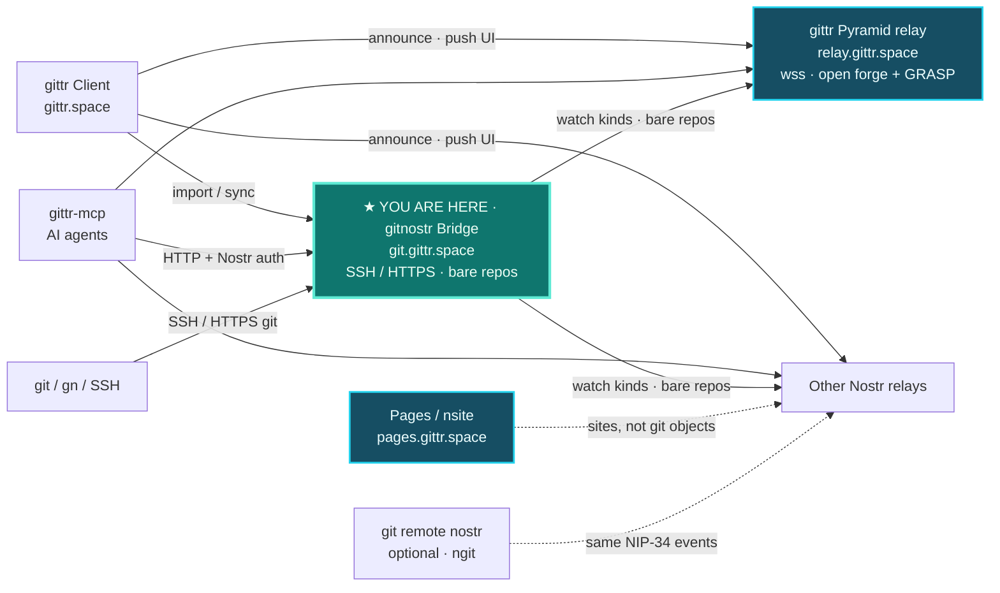

# gitnostr

**Git bridge to Nostr** for [gittr](https://gittr.space). Same codebase as **[arbadacarbaYK/gitnostr](https://gittr.space/npub1n2ph08n4pqz4d3jk6n2p35p2f4ldhc5g5tu7dhftfpueajf4rpxqfjhzmc/gitnostr?branch=main)** on gittr.

**Components:** `git-nostr-bridge` · `git-nostr-ssh` · `git-nostr-db` · `git-nostr-cli` (`gn`)

## Where this sits (platform map)

This repo is the **git server layer** — not the website and not the AI tools. **You are here = gitnostr Bridge** (`git.gittr.space`, teal). Cyan-outlined host boxes = public hostnames (teal = this repo; cyan outline = host URLs).



```mermaid
flowchart LR
  UI["gittr Client<br/>gittr.space"]
  MCP["gittr-mcp<br/>AI agents"]
  CLI["git / gn / SSH"]
  Bridge["★ YOU ARE HERE · gitnostr Bridge<br/>git.gittr.space<br/>SSH / HTTPS · bare repos"]
  RelayGittr["gittr Pyramid relay<br/>relay.gittr.space<br/>wss · open forge + GRASP"]
  Relays["Other Nostr relays"]
  Pages["Pages / nsite<br/>pages.gittr.space"]
  Remote["git remote nostr<br/>optional · ngit"]

  UI -->|announce · push UI| RelayGittr
  UI -->|announce · push UI| Relays
  UI -->|import / sync| Bridge
  MCP -->|HTTP + Nostr auth| Bridge
  MCP --> RelayGittr
  MCP --> Relays
  CLI -->|SSH / HTTPS git| Bridge
  Bridge -->|watch kinds · bare repos| RelayGittr
  Bridge -->|watch kinds · bare repos| Relays
  Pages -.->|sites, not git objects| Relays
  Remote -.->|same NIP-34 events| Relays

  classDef youAreHere fill:#0f766e,stroke:#5eead4,stroke-width:3px,color:#ecfdf5
  classDef hostUrl fill:#164e63,stroke:#22d3ee,stroke-width:2px,color:#ecfeff
  class Bridge youAreHere
  class Pages,RelayGittr hostUrl
```

| Piece | Host / on gittr | Talks to this bridge how? |
| --- | --- | --- |
| **gittr Client** | [gittr](https://gittr.space/npub1n2ph08n4pqz4d3jk6n2p35p2f4ldhc5g5tu7dhftfpueajf4rpxqfjhzmc/gittr?branch=main) · `gittr.space` | Push/import → bridge API; clone URLs point at **`git.gittr.space`** |
| **★ gitnostr (this README)** | [gitnostr](https://gittr.space/npub1n2ph08n4pqz4d3jk6n2p35p2f4ldhc5g5tu7dhftfpueajf4rpxqfjhzmc/gitnostr?branch=main) · **`git.gittr.space`** | **You are here** — bare repos, SSH keys (kind 52), permissions |
| **gittr-mcp** | [gittr-mcp](https://gittr.space/npub1n2ph08n4pqz4d3jk6n2p35p2f4ldhc5g5tu7dhftfpueajf4rpxqfjhzmc/gittr-mcp) | Agents push/list via HTTPS + signed Nostr headers |
| **Pages / nsite** | [nsite-gateway](https://gittr.space/npub1n2ph08n4pqz4d3jk6n2p35p2f4ldhc5g5tu7dhftfpueajf4rpxqfjhzmc/nsite-gateway) · **`pages.gittr.space`** | Separate — static sites from Nostr, not the git object store |
| **gittr Pyramid relay** | [pyramid](https://gittr.space/npub1n2ph08n4pqz4d3jk6n2p35p2f4ldhc5g5tu7dhftfpueajf4rpxqfjhzmc/pyramid) · **`relay.gittr.space`** | Open `wss://` forge relay the bridge also watches |
| **git remote nostr** | [ngit-cli](https://github.com/DanConwayDev/ngit-cli) | Optional; reads/writes same relay events; may also hit `clone` HTTPS |

**Addressing:** on disk, owner dirs are **hex pubkey**; HTTPS clone tags use **npub** via `npub → hex` symlinks on **`git.gittr.space`** (NIP-34-friendly). SSH accepts hex or npub.

Deeper internals: [Architecture](https://gittr.space/npub1n2ph08n4pqz4d3jk6n2p35p2f4ldhc5g5tu7dhftfpueajf4rpxqfjhzmc/gitnostr?file=docs/ARCHITECTURE.md&branch=main) (more detailed than this map).

**Docs on gittr:** [Architecture](https://gittr.space/npub1n2ph08n4pqz4d3jk6n2p35p2f4ldhc5g5tu7dhftfpueajf4rpxqfjhzmc/gitnostr?file=docs/ARCHITECTURE.md&branch=main) · [README](https://gittr.space/npub1n2ph08n4pqz4d3jk6n2p35p2f4ldhc5g5tu7dhftfpueajf4rpxqfjhzmc/gitnostr?branch=main) · [SSH guide](https://gittr.space/npub1n2ph08n4pqz4d3jk6n2p35p2f4ldhc5g5tu7dhftfpueajf4rpxqfjhzmc/gitnostr?file=SSH_GIT_GUIDE.md&branch=main)

**gittr forge:** [arbadacarbaYK/gittr](https://gittr.space/npub1n2ph08n4pqz4d3jk6n2p35p2f4ldhc5g5tu7dhftfpueajf4rpxqfjhzmc/gittr?branch=main) · [bridge setup](https://gittr.space/npub1n2ph08n4pqz4d3jk6n2p35p2f4ldhc5g5tu7dhftfpueajf4rpxqfjhzmc/gittr?file=docs/GIT_NOSTR_BRIDGE_SETUP.md&branch=main)

**Build here (monorepo):**

```bash
make git-nostr-bridge git-nostr-ssh
make git-nostr-cli   # gn
```
