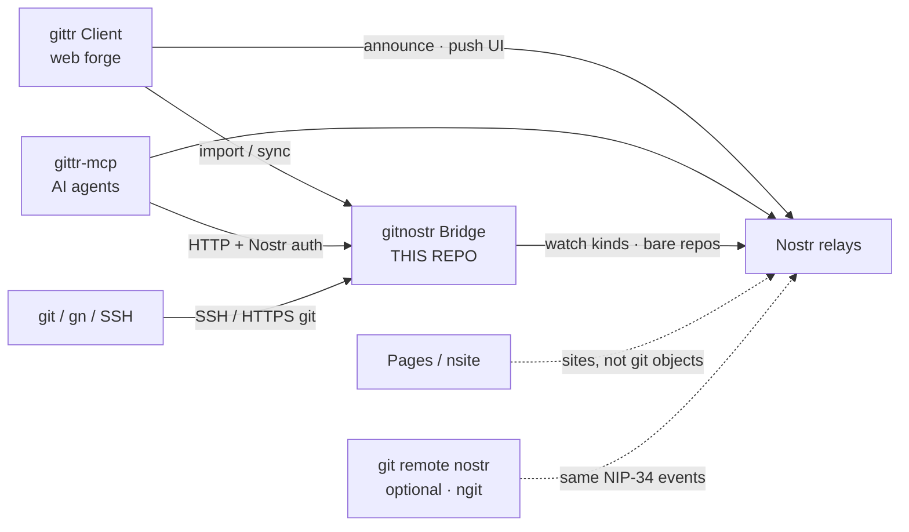

# gitnostr

**Git bridge to Nostr** for [gittr](https://gittr.space). Same codebase as **[arbadacarbaYK/gitnostr](https://gittr.space/npub1n2ph08n4pqz4d3jk6n2p35p2f4ldhc5g5tu7dhftfpueajf4rpxqfjhzmc/gitnostr?branch=main)** on gittr.

**Components:** `git-nostr-bridge` · `git-nostr-ssh` · `git-nostr-db` · `git-nostr-cli` (`gn`)

## Where this sits (platform map)

This repo is the **git server layer** — not the website and not the AI tools.


```mermaid
flowchart LR
  UI["gittr Client<br/>web forge"]
  MCP["gittr-mcp<br/>AI agents"]
  CLI["git / gn / SSH"]
  Bridge["gitnostr Bridge<br/>THIS REPO"]
  Relays["Nostr relays"]
  Pages["Pages / nsite"]
  Remote["git remote nostr<br/>optional · ngit"]

  UI -->|announce · push UI| Relays
  UI -->|import / sync| Bridge
  MCP -->|HTTP + Nostr auth| Bridge
  MCP --> Relays
  CLI -->|SSH / HTTPS git| Bridge
  Bridge -->|watch kinds · bare repos| Relays
  Pages -.->|sites, not git objects| Relays
  Remote -.->|same NIP-34 events| Relays
```

| Piece | On gittr | Talks to this bridge how? |
| --- | --- | --- |
| **gittr Client** | [gittr](https://gittr.space/npub1n2ph08n4pqz4d3jk6n2p35p2f4ldhc5g5tu7dhftfpueajf4rpxqfjhzmc/gittr?branch=main) | Push/import → bridge API; clone URLs point at `git.gittr.space` |
| **gitnostr** | [gitnostr](https://gittr.space/npub1n2ph08n4pqz4d3jk6n2p35p2f4ldhc5g5tu7dhftfpueajf4rpxqfjhzmc/gitnostr?branch=main) | **You are here** — bare repos, SSH keys (kind 52), permissions |
| **gittr-mcp** | [gittr-mcp](https://github.com/arbadacarbaYK/gittr-mcp) | Agents push/list via HTTPS + signed Nostr headers |
| **Pages / nsite** | [nsite-gateway](https://gittr.space/npub1n2ph08n4pqz4d3jk6n2p35p2f4ldhc5g5tu7dhftfpueajf4rpxqfjhzmc/nsite-gateway) | Separate — static sites from Nostr, not the git object store |
| **git remote nostr** | [ngit-cli](https://github.com/DanConwayDev/ngit-cli) | Optional; reads/writes same relay events; may also hit `clone` HTTPS |

**Addressing:** on disk, owner dirs are **hex pubkey**; HTTPS clone tags use **npub** via `npub → hex` symlinks (NIP-34-friendly). SSH accepts hex or npub.

Deeper internals: [Architecture](https://gittr.space/npub1n2ph08n4pqz4d3jk6n2p35p2f4ldhc5g5tu7dhftfpueajf4rpxqfjhzmc/gitnostr?file=docs/ARCHITECTURE.md&branch=main) (more detailed than this map).

**Docs on gittr:** [Architecture](https://gittr.space/npub1n2ph08n4pqz4d3jk6n2p35p2f4ldhc5g5tu7dhftfpueajf4rpxqfjhzmc/gitnostr?file=docs/ARCHITECTURE.md&branch=main) · [README](https://gittr.space/npub1n2ph08n4pqz4d3jk6n2p35p2f4ldhc5g5tu7dhftfpueajf4rpxqfjhzmc/gitnostr?branch=main) · [SSH guide](https://gittr.space/npub1n2ph08n4pqz4d3jk6n2p35p2f4ldhc5g5tu7dhftfpueajf4rpxqfjhzmc/gitnostr?file=SSH_GIT_GUIDE.md&branch=main)

**gittr forge:** [arbadacarbaYK/gittr](https://gittr.space/npub1n2ph08n4pqz4d3jk6n2p35p2f4ldhc5g5tu7dhftfpueajf4rpxqfjhzmc/gittr?branch=main) · [bridge setup](https://gittr.space/npub1n2ph08n4pqz4d3jk6n2p35p2f4ldhc5g5tu7dhftfpueajf4rpxqfjhzmc/gittr?file=docs/GIT_NOSTR_BRIDGE_SETUP.md&branch=main)

**Build here (monorepo):**

```bash
make git-nostr-bridge git-nostr-ssh
make git-nostr-cli   # gn
```
